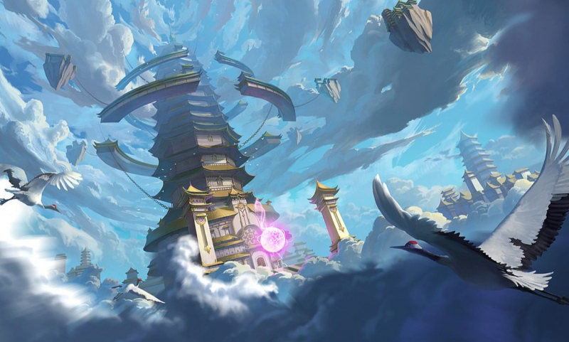

Không biết, trong các bạn có ai lớn tuổi rồi vẫn còn thích xem phim hoạt hình như mình không. Thời đại bây giờ, công nghệ thông tin phát triển, ta có thể xem được rất nhiều phim mà không có trên sóng truyền hình, cũng không cần phải chờ đợi vài ngày mới có một tập để xem. Nhưng, cho đến một ngày bộ phim kết thúc, mình nhận ra mỗi năm nhà sản xuất chỉ làm ra được một phần, khi mà nội dung truyện còn rất rất dài. Mình tức á, tìm ai đòi phim bây giờ...

Trong một Group nào đấy, mọi người bắt đầu bảo thôi qua đọc truyện chữ đi, chờ phim biết đến năm nào. Kể từ đó, mình bắt đầu đến với truyện chữ, mỗi ngày có thời gian rảnh mình đều đọc vài ba chương giết thời gian, dần dần nó trở thành thói quen của mình từ ngày đại học cho đến lúc đi làm.

Bây giờ, mình vẫn đọc nhưng không đọc nhiều như ngày trước. Đơn giản là vì khi bạn đọc quá nhiều truyện, yêu cầu của bạn đối với một bộ truyện tự nhiên cao hơn. Các bộ truyện bây giờ không sáng tạo nhiều như trước, chủ yếu viết theo xu hướng, motip truyện lặp đi lặp lại, đã không còn gây tò mò, hứng thú cho người đọc nữa. Đọc nhiều quá cũng là một cái tội, haizz.

---

#### Đã đọc:

 1. Đế Tôn _(2921/2921)_
 2. Yêu Thần Ký _(496/496)_
 3. Tiên Nghịch _(1975/1975)_
 4. Solo Leveling _(179/179)_
 5. Mục Thần Ký _(1834/1834)_
 6. Đấu La Đại Lục _(517/517)_
 7. Tinh Thần Biến _(671/671)_
 8. Lâm Uyên Hành _(961/961)_
 9. Vạn Tộc Chi Kiếp _(966/966)_
10. Nhất Thế Chi Tôn _(1425/1425)_
11. Vũ Động Càn Khôn _(1309/1309)_
12. Toàn Chức Pháp Sư _(3136/3136)_
13. Vạn Cổ Đệ Nhất Tông _(2008/2008)_
14. Đấu Phá Thương Khung _(1641/1641)_
15. Thiên Đạo Đồ Thư Quán _(2264/2264)_
16. Đại Quản Gia Là Ma Hoàng _(770/1312)_
17. Vũ Luyện Đỉnh Phong _(3282/6003)_
18. Toàn Cầu Cao Võ _(1437/1437)_
19. Vũ Thần Chúa Tể _(2793)_
20. Nhất Kiếm Độc Tôn _(1975)_
21. Ta Có Một Thân Bị Động Kỹ _(900)_
22. Cửu Tinh Bá Thể Quyết _(4800)_
23. Dạ Mệnh Danh Thuật _(750)_
24. Tinh Môn _(626/626)_
25. Nhân Đạo Chí Tôn _(1494/1494)_
26. Thâm Không Bỉ Ngạn _(1437/1437)_
27. Thôn Phệ Tinh Không _(1485/1485)_
28. Mink Đường Phố Số 13 _(350)_
29. Ta chỉ muốn an tĩnh chơi game _(1900/1900)_
30. Ta Thuộc Tính Tu Hành Nhân Sinh _(678)_
31. Cẩu Tại Yêu Võ Loạn Thế Tu Tiên _(615)_ 
32. Vừa Thành Tiên Thần, Con Cháu Cầu Ta Xuất Sơn _(650)_
33. Ta Chỉ Muốn An Tĩnh Làm Cẩu Đạo Bên Trong Người _(1500)_
34. Xích Tâm Tuần Thiên _(2100)_
35. Đạp Tinh _(2850)_

---