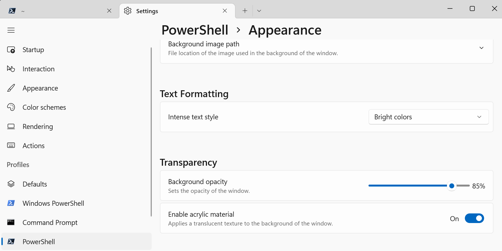
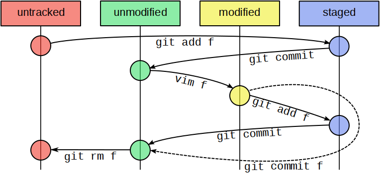
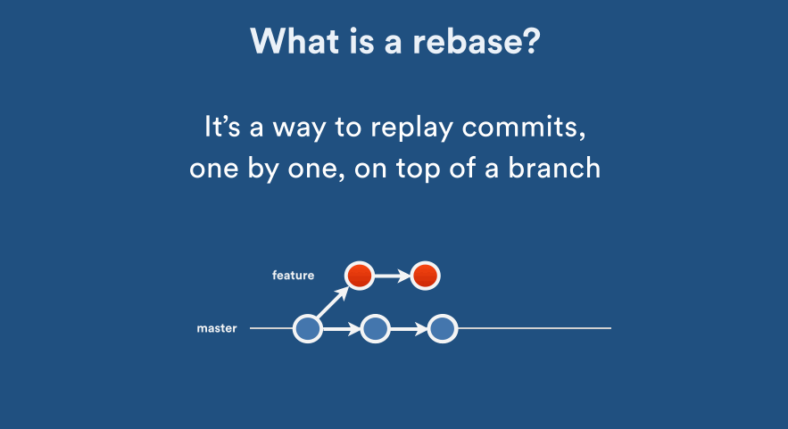

Nếu bạn là một người làm trong lĩnh vực liên quan đến lập trình hoặc công việc cần phải viết code, thì có lẽ bạn cũng không xa lạ gì với Git. Hiểu nôm na thì chúng ta thường sử dụng Git để quản lý các phiên bản code. Trước khi đi tìm hiểu về Git mình sẽ đi cài đặt một số phần mềm hỗ trợ. 

## 1. Cài đặt Windows Terminal

Cài đặt Terminal trong Windows khá là đơn giản, các bạn vào [Windows Terminal](https://www.microsoft.com/en-us/p/windows-terminal/9n0dx20hk701), sau đó chọn `install` là xong.

Trong trường hợp nếu các bạn muốn tùy biến giao diện của Terminal cho nó lung linh giống trang _[Oh My Posh](https://ohmyposh.dev/docs/themes/)_ thì làm theo hướng dẫn này:



Cuối cùng thì, để làm mờ giao diện của Terminal ta mở Setting và tùy chỉnh các tham số ở mục Transparency:



## 2. Một số command line hay dùng

Trong Unix, các thư mục được gọi là `directories`, còn các thư mục con thì được gọi là `subdirectories`. 

Trong Unix, `Root directory` giống với nơi ta cài đặt hệ điều hành trong Windows còn `Home directory` thì giống với thư mục `user` trong Windows.

### 2.1. Di chuyển giữa các thư mục

```bash
# echo 'text', in một đoạn text ra màn hình
echo "Tomorrow is another day"
```

```bash
# Working directory, trả về vị trí thư mục hiện tại của chúng ta
pwd

# Trong unix, ~ = home directory, . = working directory, đại diện cho all files

# Lệnh ls - xem danh sách các file và subdirectories 
ls
ls -a # hiển thị all tệp, cả tệp ẩn
```

```bash
# Di chuyển với cd <path/folder_name>
cd <folder_name>
cd <path_to_folder_name>

# Di chuyển đến thư mục parent của thư mục hiện tại
cd ..

# Home directory
cd ~

# Trở lại directory vừa di chuyển
cd -
```

### 2.2. Tạo và xóa thư mục

```bash
# Tạo directory - mkdir = make directory
mkdir <folder_name>

# Tạo file
touch <file_name>
```

```bash
# Xóa directory - rmdir = remove directory nếu thư mục rỗng
rmdir <folder_name>

# Xóa directory - rm -r nếu thư mục có chứa các file
rm -r <folder_name>

# Trường hợp folder chứa các file khó xóa, sử dụng
rm -rf <folder_name>
```

### 2.3. Copy, di chuyển và xóa file

```bash
# Di chuyển file, lưu ý là nếu file trùng tên sẽ bị ghi đè
mv <path_to_file> <path_to_destination_directory>

# Đổi tên tệp
mv <older_name> <new_name>

# Kết hợp di chuyển và đổi tên tệp
mv <path_to_file> <path_to_destination_directory/new_name>

# Copy tương tự movie, thay mv = cp

# Xóa file vĩnh viễn
rm <path_to_file>
```

### 2.4. Xem nội dung của một file

```bash
# Xem một phần nội dung
less <path_to_file>

# Thoát khỏi 
q
```

<details>
<summary>
<b>Wild Cards</b>
</summary>

_Được sử dụng để thay thế cho các ký tự trong tên files, trong đó ký tự `?` sẽ thay thế cho một ký tự bất kỳ, còn ký tự `*` sẽ thay thế cho một hoặc nhiều ký tự._

</details>

## 3. Git and GitHub

### 3.1. Cài đặt và cấu hình Git

```bash
git config --global user.name "your_name"
git config --global user.email "your_email"
git config --global core.editor "code --wait"
```

### 3.2. Làm việc ở Local

**Khởi tạo Repository ở local:**

```bash
# Tạo repository ở local
cd folder_name
git init

# Clone từ remote repository
git clone <url>
```

**Sau khi thêm các files hoặc thực hiện thay đổi trong repository, chúng ta cần add và commit:**



```bash
# Xem trạng thái
git status

# Add các file đã thay đổi
git add <files>

# Thêm tất cả các files
git add .

# Commit + editor
git commit

# Commit kèm commit message
git commit -m "commit message"
```

**Xem lịch sử commit:**

```bash
# History log
git log

# Oneline
git log --oneline
```

**So sánh các phiên bản:**

```bash
# So sánh files vừa thay đổi
git diff

# So sánh files đã được thêm vào staged
git diff --staged

# So sánh các files hiện tại với các files n commit trước đó
git diff HEAD~<NUMBER>

# Thay vì sử dụng HEAD~n, ta có thể dùng hash
git diff <HASH>
```

**Khôi phục lại sự thay đổi:**

```bash
# Sau khi sửa đổi files, lại không muốn commit
git restore <file>

# Khôi phục lại các files ở một commit cụ thể
git restore --source <HASH or HEAD~> <files>
```

**Loại bỏ các files khỏi Git:**

<p style="text-align:justify">Trong nhiều tình huống, chúng ta muốn loại bỏ một số file ví dụ như các files nhị phân, files biên dịch của chương trình... khỏi Git. Để làm điều đó, chúng ta tạo thêm một files gọi là <code>.gitignore</code> sau đó thêm danh sách các <code>files, path_to_files, folders</code> vào trong files này.</p>

<p style="text-align:justify">Mặc định, Git sẽ không thêm các thư mục rỗng. Tuy nhiên, nếu bạn vẫn muốn thêm thư mục đó, thì chúng ta cần phải tạo file <code>.gitkeep</code> bên trong thư mục rỗng đó.

### 3.3. Tương tác với Remote

```bash
# add remote
git remote add origin <remote-repository>

# Xem danh sách các remote
git remote -v

# Đẩy các file và folder ở local lên remote
# -u: Với lần sử dụng đầu tiên, từ sau chỉ cần git push là git hiểu
git push -u origin main

# Xóa remote
git remote rm <remote-repository>

# Đồng bộ hóa những thay đổi ở remote về local
git pull origin main
```

### 3.4. Git Branch

**Tạo nhánh**

```bash
# Tạo nhánh
git branch <branch_name>

# Di chuyển đến nhánh branch_name
git switch <branch_name>

# Trở lại nhánh chính
git switch main

# Xem danh sách các branch
git branch -a

# Xóa nhánh
git branch -d <branch_name>

# Xem history
git log --oneline --graph --all
```

**Merge Branch:**

```bash
# merge cơ bản
git switch main
git merge <branch_name>
```

**Git Rebase:**




```bash
# Git rebase, merge branch main vào nhánh hiện tại
git switch <BRANCH_NAME>
git rebase main

# Nếu gặp conflict, sửa lại lỗi sau đó
git add <FILES>
git rebase --continue

# Trở lại nhánh chính, và merge sự thay đổi
git switch main
git merge <BRANCH_NAME>
```


<p style="text-align:justify">Khi chúng ta có nhiều Commit, việc sử dụng rebase nếu gặp nhiều conflict, chúng ta sẽ phải sửa lỗi nhiều lần. Thay vì vậy, chúng ta có thể sử dụng <code>squash</code> để gom tất cả commit trong branch vào một, khi đó ta chỉ cần sửa một lần là được.</p>

```bash
# Về branch
git switch <BRANCH_NAME>

# squash n commit
git rebase -i HEAD~<NUMBER>
```

**Git Stash**

<p style="text-align:justify">Có đôi khi, chúng ta đang làm dở một việc nào đó, nhưng lại phải trở về nhánh chính để làm một việc khác mà chúng ta không muốn thực hiện commit, thì có thể sử dụng <code>git stash</code> để lưu lại công việc ở nhánh hiện tại trước khi di chuyển đến nhánh khác.</p>

```bash
# Tạo stash
git stash

# Danh sách các stash
git stash list

# Trở lại 
git stash apply 

# Xóa các stash
git stash clear
```

### 3.5. Pull Request

**Push một nhánh lên GitHub:**

```bash
# Checkout branch
git switch <BRANCH_NAME>

# Do something
# Push
git push origin <BRANCH_NAME>

# Nhánh được đẩy lên GitHub
# Pull Request được đề xuất để merge các nhánh với nhau
# Sau khi thực hiện merge và xóa branch, đồng bộ với local
git pull origin main

# Đồng bộ branch
git fetch --prune
git branch -d <BRANCH_NAME>
```

**Giải quyết Pull Request conflict ở local:**

```bash
# fetch
git fetch --prune

# Di chuyển HEAD 2 cách
git pull origin main
git reset --hard origin/main

# Di chuyển đến nhánh conflict và merge
git switch <BRANCH_NAME>
git rebase main
git add
git rebase --continue

#Push trở lại remote
git push -f origin <BANCH_NAME>
```

### 3.6. Git Workflows

**Workflows cơ bản:**

```bash
# Bước 1: Đồng bộ local với remote
git pull origin main

# Bước 2: Phát triển tính năng mới
# Tạo nhánh
git switch -c <New_Branch>

# Do something
# Push branch to remote
git add 
git commit
git push origin <New_Branch>

# Tạo Pull Request và Merge
```

```bash
# Trường hợp `: Merge không gặp vấn đề gì
# Làm sạch local
git switch main
git pull origin main
git fetch --prune
git branch -d <New_Branch>
```

```bash
# Trường hợp 2: Gặp conflict
# Update lại nhánh main
git switch main
git pull origin main

# Merge
git switch <New_Branch>
git rebase main

# Sửa conflict
git add
git rebase --continue

# Push to remote để merge
git push --f origin <New_Branch>
git push --force-with-lease origin <New_Branch>

# Merge Pull Request
# Làm sạch Local
git switch main
git pull origin main
git fetch --prune
git branch -d <New_Branch>
```

---