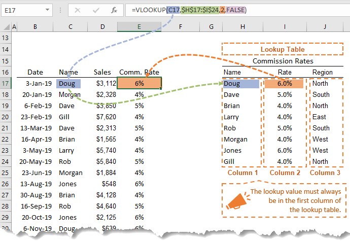

Excel, luôn là một trong những kỹ năng cần có của dân văn phòng. Và với mỗi vị trí, Excel lại được sử dụng với những mục đích khác nhau. Với mình, Excel được sử dụng chủ yếu để xử lý, phân tích dữ liệu và làm báo cáo. 

Bài viết này, không phải là một bài hướng dẫn sử dụng Excel mà chỉ là một bài tóm tắt lại một số hàm và tính năng mình thường sử dụng trong quá trình làm việc. 

## 1. Một số hàm hay sử dụng

### 1.1. Hàm tra cứu

Hàm tra cứu là một số hàm được sử dụng để tìm kiếm hoặc lấy một giá trị từ một bảng dữ liệu nguồn cho bảng dữ liệu hiện tại. Dưới đây là một số hàm mình hay sử dụng:

**Hàm `VLOOKUP`**

```excel-formula
= VLOOKUP(lookup_value,table_array,column_index_num,[range_lookup])
```


<p style="font-size:90%;text-align:right"><i><a href="https://www.myonlinetraininghub.com/">Nguồn: My Online Training Hub</a></i></p>

**Hàm `INDEX` và `MATCH`**

```xlsx
= MATCH(lookup_value, lookup_array, [match_type])

= INDEX(array, row_num, [col_num], [area_num])
```

**Hàm `CHOOSE`**

```xlsx
= CHOOSE(index_num, value1, [value2], ...)
```

### 1.2. Hàm logic

### 1.3. Hàm điều kiện

### 1.4. Hàm chỉ sử dụng với Excel 365

Gần đây Microsoft đã cho ra mắt một số hàm được sử dụng trên Excel 365 giúp cho việc xử lý dữ liệu thuận tiện và dễ dàng hơn.

**Hàm `XLOOKUP`**

**Hàm `FILTER`**

**Hàm `SORT`**

**Hàm `SORT BY`**

**Hàm `UNIQUE`**


