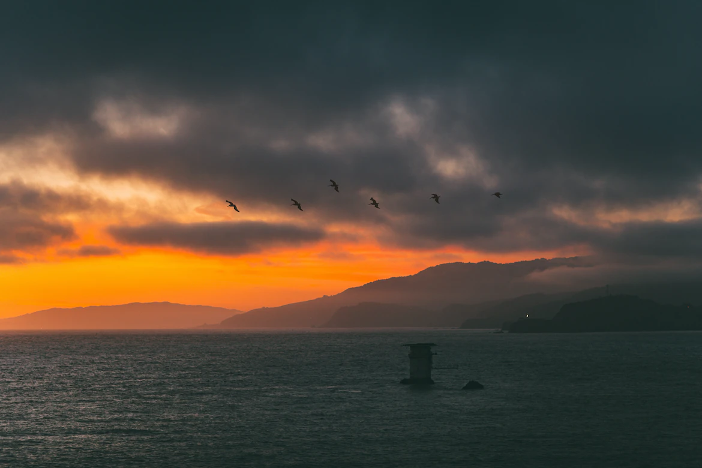

Hà Nội, 15/01/2023

Tôi tỉnh dậy sau một giấc ngủ dài, không cần phải nghe tiếng chuông báo thức inh ỏi vào mỗi buổi sáng như mọi khi. Hôm nay là chủ nhật. Ngày chủ nhật cuối cùng của năm. Và chỉ còn một vài ngày nữa là kết thúc năm 2022. Không biết, một năm qua bạn đã làm được những gì và còn gì tiếc nuối hay không.

Thật lòng mà nói, với tôi năm vừa rồi trôi qua một cách không biết giải thích như thế nào, cảm thấy kiểu mình bị giậm chân tại chỗ, cuộc sống hoang mang, bế tắc, nhiều chuyện không biết nên bắt đầu từ đâu. Giống như bài viết này, tôi cũng nghĩ mãi mới quyết định viết.

Cũng phải hơn 4 tháng rồi, tôi không viết gì. Đó là một quảng thời gian khá dài, tôi mất phương hướng và không tìm thấy chính mình. Lúc đầu tôi định viết một bài có tên là <i>"Thế giới rộng lớn, lòng người chật hẹp"</i> nhưng rồi lại thôi.

Hôm qua, tôi và em hẹn gặp nhau. Em hỏi tôi muốn đi đâu. Tôi bảo tôi muốn đi với em, nhưng mà nay tôi không có xe, hay là em qua đón tôi đi. Rồi mình qua quán đối diện ăn ốc, xong anh sẽ dẫn em qua Nik lên tầng 10 ăn kem bơ và ngắm thành phố về đêm. Trời lạnh như này ăn kem thì quá hợp rồi.

---

_P/s: đang viết..._