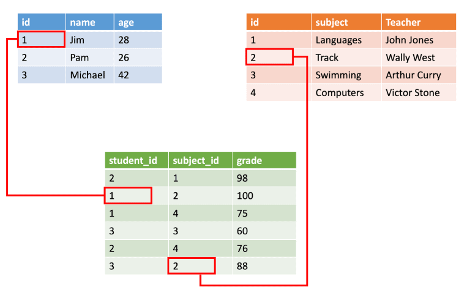
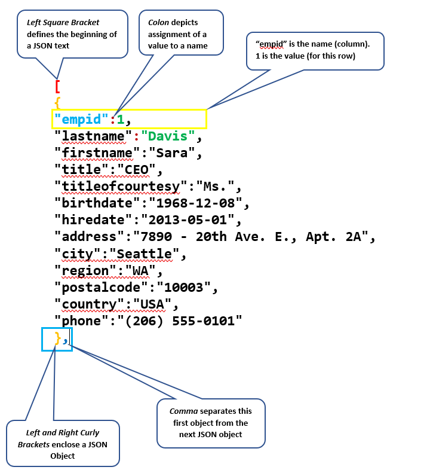
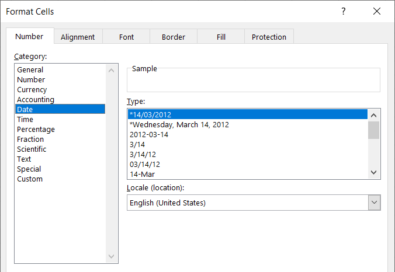
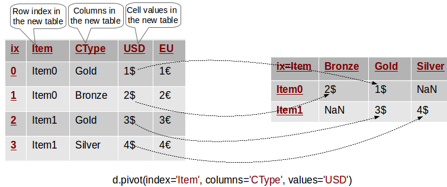
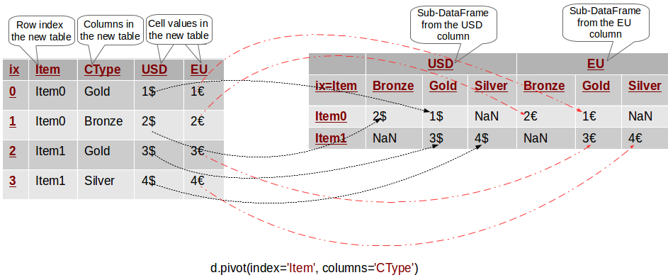
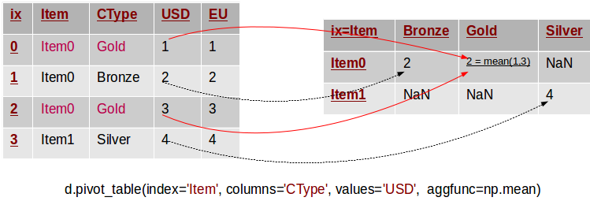
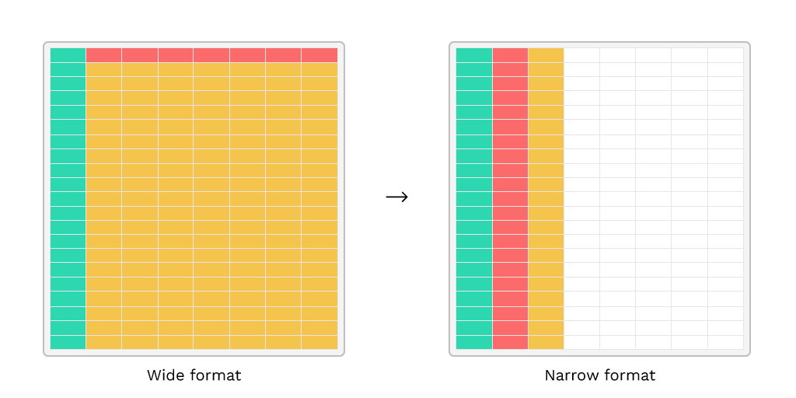
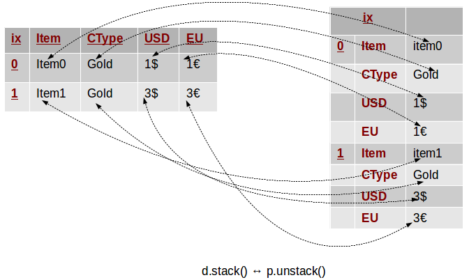
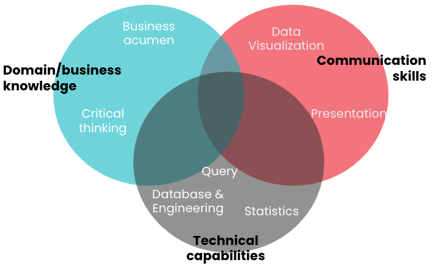

## 1. Data là gì?

Dữ liệu <i><b>(data)</i></b> là gì? Thực sự mình cũng không biết phải định nghĩa như nào, vì có quá nhiều định nghĩa về dữ liệu. Nhưng nếu hiểu theo cách nôm na thì dữ liệu là mọi thứ xung quanh chúng ta, ví dụ như tên, tuổi, giá sản phẩm...

Mình nhớ hình như trong môn tin học lớp 10 cũng có một định nghĩa về data như thế này:

Chúng ta sẽ bắt đầu với khái niệm về <b><i>thông tin</i></b>. Thông tin là sự hiểu biết của con người về một thực thể nào đó, được thể hiện dưới dạng các tín hiệu như chữ số, âm thanh, hình ảnh,...mà chúng ta có thể thu thập, lưu trữ và xử lý được. Thì dữ liệu là các thông tin đã được mã hóa trên máy tính.

## 2. Cấu trúc dữ liệu

### 2.1. Structured data

Dữ liệu có cấu trúc thường là dữ liệu được lưu trữ ở dưới dạng bảng, ví dụ như các bảng dữ liệu trong Excel và database,...Mỗi một bảng dữ liệu gồm các dòng và các cột. Các cột thường đại diện cho các biến hoặc thuộc tính còn các dòng thì đại diện cho các quan sát, record...Ví dụ:

### 2.2. Semi-structured data

Dữ liệu bán cấu trúc (mình không biết dịch như vậy có chuẩn không nữa), đây là những dữ liệu không được lưu trữ ở dưới dạng bảng như dữ liệu có cấu trúc nhưng lại có một cấu trúc nhất định. Ví dụ như dữ liệu lưu trữ trong các file <code>xml, json</code>:

### 2.3. Unstructured data

Dữ liệu phi cấu trúc là những dữ liệu được lưu trữ ở định dạng mà chúng ta không thể xác định được cấu trúc của chúng. Ví dụ như dữ liệu lưu trữ trong các file <code>pdf</code>, hình ảnh, video, âm thanh, email...

## 3. Kiểu dữ liệu

Kiểu dữ liệu là một khái niệm khá quan trọng khi chúng ta sử dụng các ngôn ngữ lập trình như Python, R... hoặc là các công cụ xử lý dữ liệu như SQL, Excel, Power BI...

Vậy kiểu dữ liệu là gì? Ta có thể hiểu nôm na đó là cách chúng ta lưu trữ thông tin ở trên máy tính. Mỗi một thuộc tính, đều có một kiểu dữ liệu xác định. Với mỗi một công cụ, đều có những cách phân loại khác nhau nhưng tóm lại nó có thể được quy về một trong 5 loại sau:

- **Strings**: là tập hợp các ký tự alphanumeric `a-zA-Z, 0-9` và một số ký tự đặc biệt.
- **Numeric**: là các số bao gồm số nguyên và số thập phân.
- **Date/Time**: là các dữ liệu miêu tả ngày tháng, thời gian hoặc kết hợp cả ngày tháng và thời gian.
- **Boolean**: là kiểu dữ liệu chỉ có hai giá trị đại diện cho `True` và `False`.
- **Special Objects**: là các kiểu dữ liệu đặc biệt như hình ảnh, âm thanh, video, maps...

<b>Data Formats</b>

Lưu ý là mặc dù kiểu dữ liệu được phân thành 5 loại, nhưng với mỗi loại lại có nhiều định dạng <i>(formats)</i> khác nhau tùy thuộc vào từng công cụ. Ví dụ như kiểu Date/Time trong Excel:

## 4. Pivot và stacked

Sau này, khi xử lý dữ liệu, một trong những thao tác biến đổi chúng ta có thể sẽ phải làm là chuyển đổi định dạng <i>(số chiều, kích thước)</i> của bảng dữ liệu.

### 4.1. Pivot

Pivot hiểu đơn giản thì nó được sử dụng để tạo ra một bảng mới tổng hợp dữ liệu từ một bảng dữ liệu nào đó. Dễ hình dung là tính năng PivotTable trong Excel.

<figure><figcaption class="img-cap">Pivoting Simple</figcaption></figure>

<figure><figcaption class="img-cap">Multi-column Pivoting</figcaption></figure>

<figure><figcaption class="img-cap">Pivot Table</figcaption></figure>

### 4.2. Stacked và unstacked

- Stacked (đôi khi gọi là _narrow format_)
- Unstacked (đôi khi gọi là _wide format_)

## 5. Analysis và analytics

### 5.1. Data analysis

<b><i>Data Anaysis</b></i> là quá trình đi tìm câu trả lời cho những câu hỏi như <i>What, How, Why</i> từ dữ liệu trong <b>quá khứ</b> hay nói một cách khác là cách chúng ta đặt câu hỏi và thu thập những hiểu biết từ những thông tin đã có. Ví dụ như: Doanh thu tháng trước của sản phẩm X là bao nhiêu, tại sao doanh số của sản phẩm đó vào mùa hè lại giảm mạnh,...

### 5.2. Data analytics

<b><i>Data Analytics</b></i> là một quá trình sử dụng các công cụ bao gồm thu thập, xử lý, phân tích thống kê, mô hình hóa và khám phá dữ liệu trong <b>quá khứ</b> để tìm ra các insights có giá trị hỗ trợ cho các <b>quyết định</b> trong tương lai. Đây là một lĩnh vực rộng lớn, mỗi tổ chức, mỗi phòng ban có thể có các kỳ vọng, mục đích sử dụng và tên gọi khác nhau đối với ngành này. Nhưng nói chung, công việc sẽ xoay quanh một số nhiệm vụ sau:

- **Domain knowledge**: Đặt ra các vấn đề trong kinh doanh và xác định dữ liệu có liên quan đến vấn đề đó.
- **Technicals knowledge**: Thu thập, biến đổi, làm sạch, tổng hợp và phân tích dữ liệu bằng các kỹ thuật như _querying, statistics, data modeling,..._
- **Communication skills**: Trình bày kết quả phân tích bằng các kỹ thuật như _data visualization_ và _storytelling_.
- **Machine learning**: Xây dựng các mô hình học máy và phát triển các sản phẩm dữ liệu.

## 6. Các thành kiến trong phân tích dữ liệu

Giả sử, bạn là một nhà phân tích sản phẩm <i>(product analyst)</i> và bạn đang có ý tưởng về một sản phẩm mà bạn cho là rất tuyệt vời. Sau đó, bạn bắt tay vào phân tích và thử nghiệm với hy vọng kết quả có vẻ tốt nhưng điều ngược lại xảy ra, nó không ổn cho lắm. Bạn tự hỏi, có lẽ không phải lỗi ở sản phẩm mà ở các khâu khác ví dụ như marketing hoặc hoạt động bán hàng. Đây là một ví dụ về thiên kiến nhận thức <i>(cognitive biases)</i> khi ra quyết định <i>(decision making)</i> vì biết đâu, vấn đề lại nằm ở phía bạn, có thể do một sai sót nào đó trong quá trình phân tích đã dẫn đến kết quả không mong muốn.

Trong phân tích dữ liệu, có ba lỗi chúng ta có thể sẽ mắc phải khi ra quyết định, dĩ nhiên ngoài ba lỗi này ra còn rất nhiều lỗi khác mà các bạn có thể tìm hiểu thêm khi nghiên cứu về <b><i>Decision Making</i></b>.

<b>Confirmation Bias</b> <i>(Thiên kiến xác nhận)</i>: Lỗi này xảy ra khi chúng ta chỉ chấp nhận những kết quả hoặc những dữ liệu mà mang lại kết quả phân tích củng cố niềm tin của chúng ta, mà bỏ qua những kết quả phản bác lại niềm tin của chúng ta.

<b>Overconfidence</b> <i>(Quá tự tin)</i>: Lỗi này thường xảy ra khi chúng ta có xu hướng cho rằng các phân tích, dự báo của chúng ta chính xác hơn thực tế hoặc quá tin tưởng vào độ chính xác của các dự báo và sau đó đưa ra quyết định dựa trên những dự báo này mà bỏ qua những rủi ro có thể gặp phải.

<b>Overfitting</b>: Lỗi này thường gặp trong <i>machine learning</i>, khi mà mô hình chúng ta tìm được dự báo quá chính xác với bộ dữ liệu trong quá khứ <i>(training data)</i>. Việc này có thể dẫn đến các dự báo không chính xác trong tương lai khi có thêm dữ liệu được thêm vào bộ dữ liệu hiện tại.

---