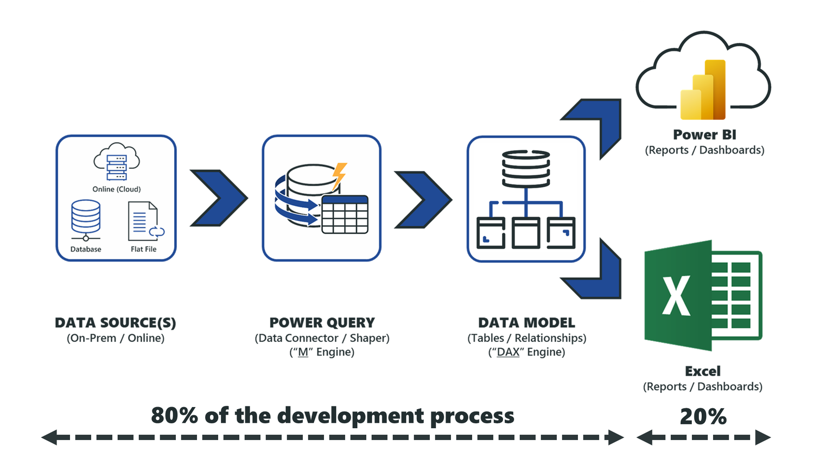

## 1. Data Model là gì?

Data Model trong Power BI hiểu đơn giản thì nó là một tập hợp của các bảng <b></i>(table)</b></i> được liên kết với nhau theo một mối quan hệ <b>(relationships)</b> dựa trên các <code>keys</code> trong bảng. Chúng ta có thể hình dung mỗi một bảng sẽ thể hiện một vấn đề nào đó. Ví dụ các vấn đề như sales, products, customers...

Data model là một khung nền tảng bắt buộc phải có trước khi bắt tay vào phân tích dữ liệu. Tùy thuộc vào chất lượng của data model mà sẽ ảnh hưởng nhiều hay ít đến hiệu quả của các reports, visualizations và dashboards.

## 2. Data model components

### 2.1. Fact and dim tables

Giả sử trong database có 100 bảng dữ liệu, thì ta không thể nào hoặc nếu có thể thì cũng không nên tạo một cái data model với 100 bảng, liệu một data model như vậy nó có hợp lý hay không. Chúng ta nên cố gắng xây dựng một data model đơn giản, các bảng được sắp xếp dễ hiểu với số lượng tối thiểu nhưng vẫn phải đảm bảo đầy đủ các thông tin cần thiết. Vậy dựa vào đâu để xác định bảng nào là bảng nên đưa vào data model và bảng nào thì không?

Đầu tiên, chúng ta cần đi xác định các <b>dữ liệu transactions</b>. Đây là những dữ liệu có tính chất thay đổi thường xuyên theo thời gian, ví dụ như thay đổi theo ngày, theo giờ, theo tuần...thì với những dữ liệu này, người ta chỉ lưu trữ những thông tin định danh cơ bản ví dụ như id của một đối tượng,...và các con số mang tính chất tính toán liên quan đến đối tượng được định danh đó.

Với dữ liệu transactions người ta sẽ không lưu trữ các thông tin chi tiết về một đối tượng. Vậy khi muốn biết các thông tin chi tiết đó ta phải tìm ở đâu? Thì thông thường ta sẽ phải lấy thông tin ở các bảng dữ liệu khác để bổ sung thêm thông tin cho bảng transactions.

Người ta phân loại các bảng dữ liệu mà bổ sung thông tin cho bảng transactions thành 4 nhóm:

- **Who:** Các thông tin liên quan đến con người, ví dụ các sản phẩm được bán cho ai...
- **What:** Các thông tin liên quan đến sự vật, ví dụ như các sản phẩm được bán là sản phẩm nào...
- **When:** Thông tin về thời gian, ví dự như sản phẩm được bán ở thời điểm nào, tháng nào, quý nào...
- **Where:** Thông tin về địa lý, ví dụ như sản phẩm này được bán ở địa chỉ nào, khu vực nào...

Các bảng transactions còn được gọi là **Data table** hoặc **Fact table**.

Các bảng bổ sung thông tin cho _bảng Fact_ được gọi là bảng **Dimensions**, bảng **Dim** hoặc **Lookup table**.

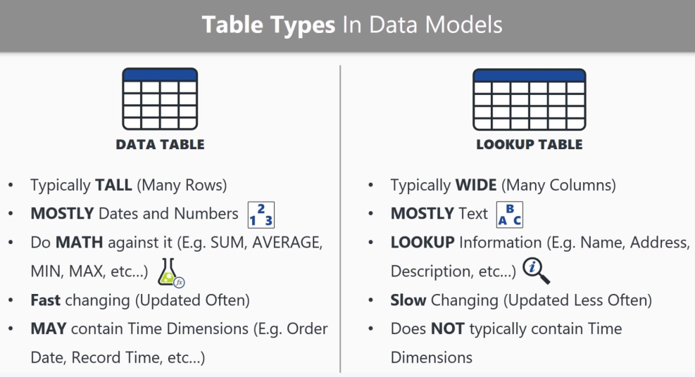

Với mỗi bảng Dim, ta sẽ có một cột khóa chính. Đây là cột chứa các giá trị duy nhất dùng để phân biệt các đối tượng. Bảng Fact sẽ chứa nhiều cột khóa ngoại, được sử dụng để xác định các mối liên kết <b><i>(relationships)</b></i> với bảng Dim.

Thông thường, trong nhiều bộ phận hoặc phòng ban, chúng ta sẽ gặp phải tình huống đó là tất cả dữ liệu được lưu trữ trong một bảng duy nhất, bảng này được gọi là <code>flat table</code> hoặc <code>single table</code>. Tuy nhiên, cách lưu trữ dữ liệu thế này không phải là cách tối ưu, bởi vì dữ liệu trong một số cột sẽ bị lặp đi lặp lại rất là nhiều lần hoặc đôi khi thông tin giữa các cột cũng bị trùng lặp với nhau. Ví dụ:

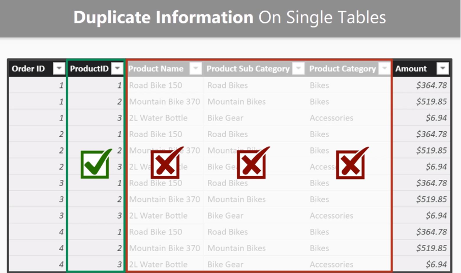

Do đó, chúng ta phải tách `single table` thành các bảng nhỏ hơn như `data table` và `lookup table` để hạn chế việc lặp dữ liệu và giúp cho việc lưu trữ được tối ưu hơn.

### 2.2. Schema

Sau khi chúng ta đã xác định và phân loại được hai loại bảng là `data table` và `lookup table`, việc tiếp theo chúng ta phải làm đó là sắp xếp lại các bảng sao cho nó hợp lý và dễ hiểu. Và cái việc sắp xếp các bảng như thế này người ta gọi là **schema**.

Có nhiều loại schema, nhưng mà trong Power BI chúng ta sẽ thường làm việc với **star schema**.

 

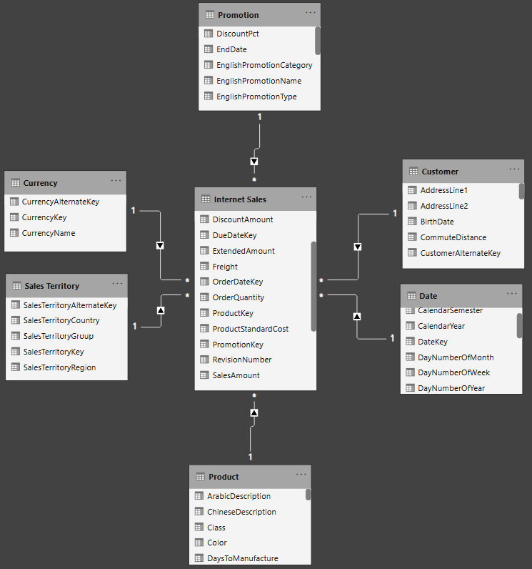

Ngoài ra, chúng ta còn có **snowflake schema**, đây là loại data model biến thể của _star schema_ mà sẽ có thêm các bảng để bổ sung thông tin cho bảng Dim _(lookup table)_.

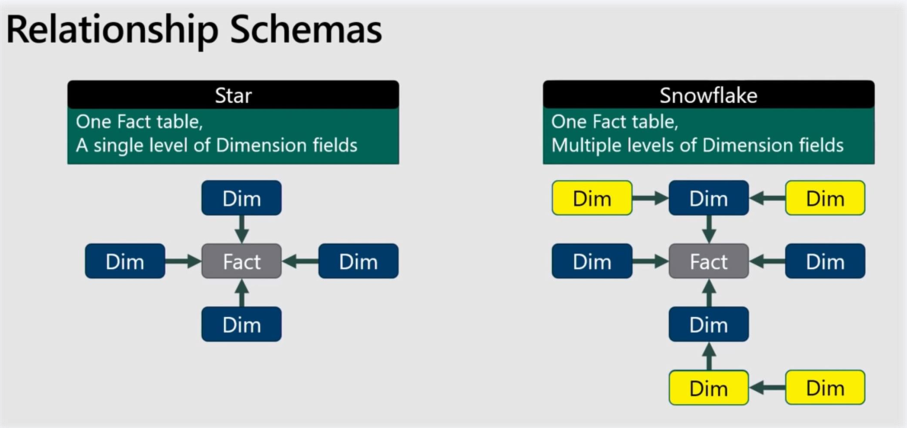

 

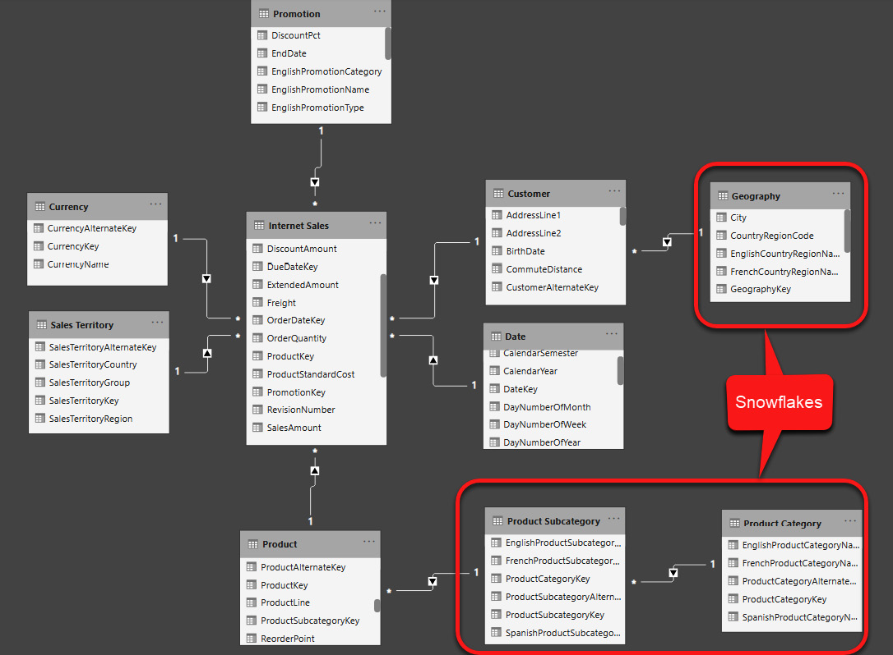

Thực tế, khi xây dựng data model, ta sẽ có nhiều bảng Fact cùng chia sẻ với nhau một hoặc một số bảng Dim:

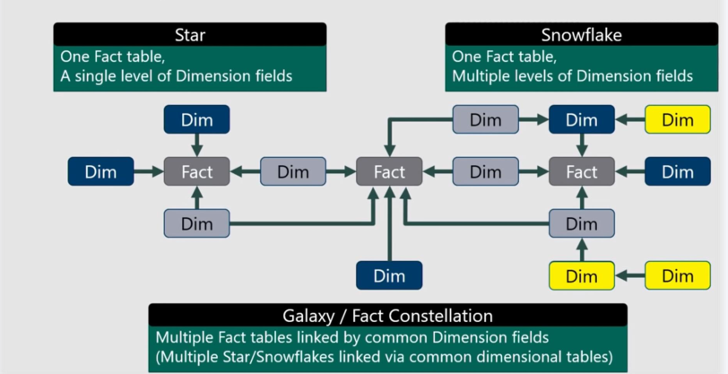

### 2.3. Relationships

Relationships hiểu đơn giản là mối liên kết giữa một table với một table khác được xác định bởi một single column từ mỗi table, bạn không thể định nghĩa một mối quan hệ dựa vào nhiều column nhưng bạn có thể tạo một column mới kết hợp các column trên với nhau để sử dụng làm cột xác định mối liên kết.

### 2.4. Cardinality

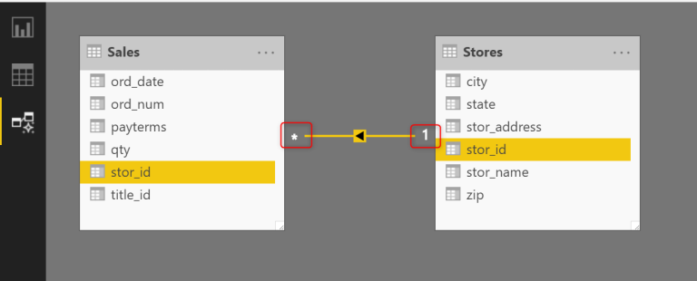

Cardinality, là một thuộc tính của relationships và trong Power BI thì có ba loại cardinality chính:

- One-to-one
- One-to-many
- Many-to-many _(Many-to-one + one-to-many)_

### 2.5. Filter direction

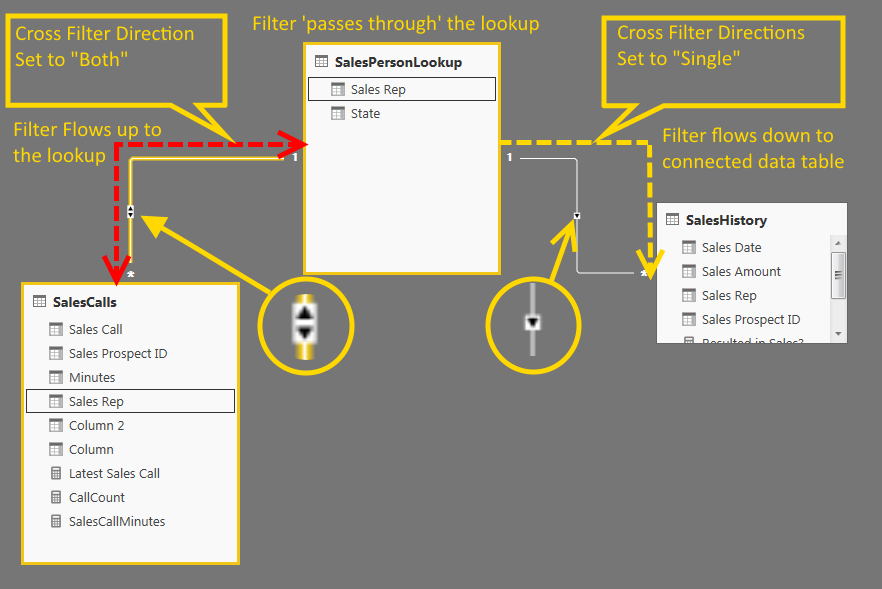

Filter direction dịch ra có nghĩa là hướng lọc, thì trong Data model chúng ta thường sẽ bắt đầu từ bảng Dim, sau đó đi theo chiều của mũi tên để lọc hoặc lấy thêm các dữ liệu, thông tin bổ sung cần thiết. Trong Power BI, có hai loại <code>filter direction</code>:

- **Bộ lọc một chiều** _(single direction)_: Với trường hợp này, chúng ta chỉ có thể lấy dữ liệu từ các bảng khác theo chiều của mũi tên mà không thể làm ngược lại được. Với mối quan hệ `one-to-many` luôn luôn là một chiều từ `one -> many`.
- **Bộ lọc hai chiều** _(both)_: Ngược lại với một chiều, chúng ta có thể lọc dữ liệu được ở cả hai chiều.

### 2.6. Hierarchies

Hierarchies, là những dữ liệu có tính chất phân cấp. Ví dụ như thời gian thì có thể phân cấp như: `Năm > quý > tháng > tuần > ngày`

## 3. Làm quen với Power BI

Power BI không chỉ là một công cụ làm báo cáo mà mọi người vẫn hay sử dụng để xây dựng các reports đẹp mắt. Nó còn là một nền tảng cung cấp một loạt các tính năng từ chuẩn bị dữ liệu <b>(data preparing)</b> đến mô hình hóa dữ liệu <b>(data modeling)</b> và trực quan hóa dữ liệu <b>(data visualizations)</b>.

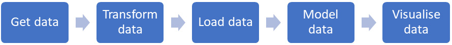

Đây cũng là một trong những hệ sinh thái phân tích dữ liệu được xây dựng rất tốt, mang lại cho người dùng khả năng đóng góp vào quy trình phân tích dữ liệu của tổ chức theo nhiều cách. Từ chia sẻ bộ dữ liệu <b>(datasets)</b>, làm các reports và tạo các dashboards đến sử dụng các thiết bị di động để thêm một số nhận xét vào reports, đặt các câu hỏi và gửi chúng đến cho những người dùng có liên quan.

Tất cả những điều này chỉ mang lại kết quả phân tích tốt khi chúng ta thực hiện các bước chính xác trong việc xây dựng hệ sinh thái Power BI. Một báo cáo đẹp không có ý nghĩa gì nếu nó hiển thị số liệu kinh doanh không chính xác hoặc nếu báo cáo quá chậm để hiển thị sẽ ảnh hưởng đến những người có nhu cầu sử dụng nó.

Một trong những khía cạnh quan trọng nhất của việc xây dựng hệ sinh thái Power BI là có một bộ dữ liệu tốt. Trong các tình huống thực tế, bạn thường phải lấy được dữ liệu từ các nguồn khác nhau và import nó vào Power BI. Sau đó, bạn cần đưa ra một data model được thiết kế tốt để đảm bảo nó luôn đại diện cho các dữ liệu hỗ trợ cho các mục đích phân tích, xây dựng reports, dashboards và cuối cùng là storytelling.

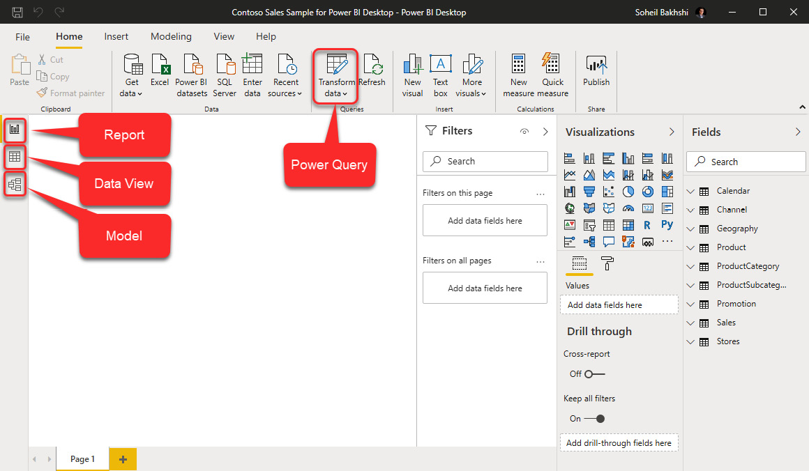

Trong Power BI, chúng ta có ba giao diện chính. Thứ nhất là <b>Power Query layer</b>, trong layer này, bạn sẽ lấy dữ liệu từ các nguồn khác nhau, biến đổi và làm sạch dữ liệu đó và load nó vào Data Model.

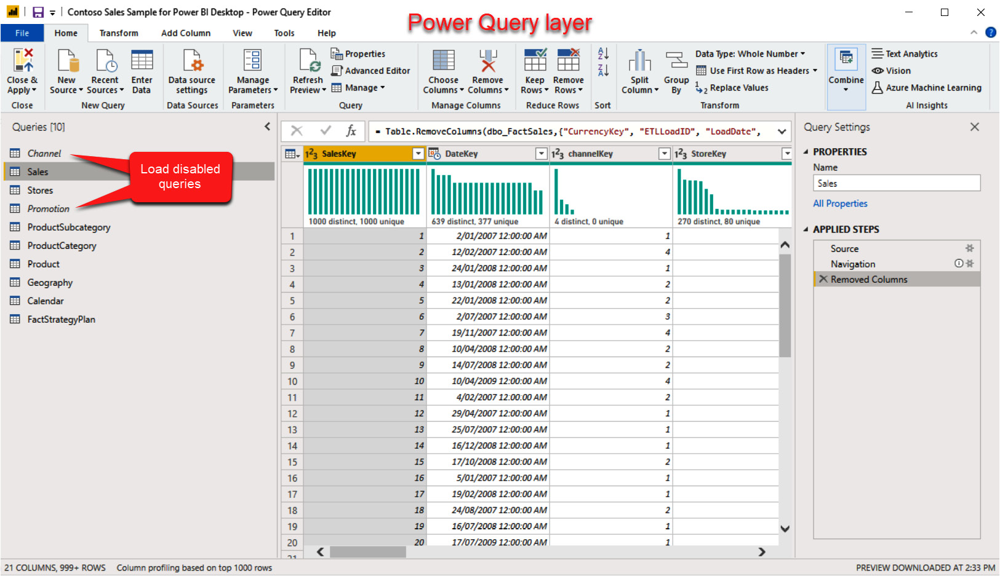

<b>Data Model layer</b> gồm <i><b>data view</b></i> và <i><b>model view</b></i>. Sau khi chúng ta hoàn thành việc chuẩn bị dữ liệu trong Power Query layer, chúng ta sẽ tải dữ liệu vào Data Model layer. Với chế độ <i><b>Data View</b></i>, chúng ta có thể thấy dữ liệu cơ bản của mình sau khi nó đã được biến đổi. Và tùy thuộc vào chế độ kết nối, dữ liệu có thể được hiển thị hoặc không.

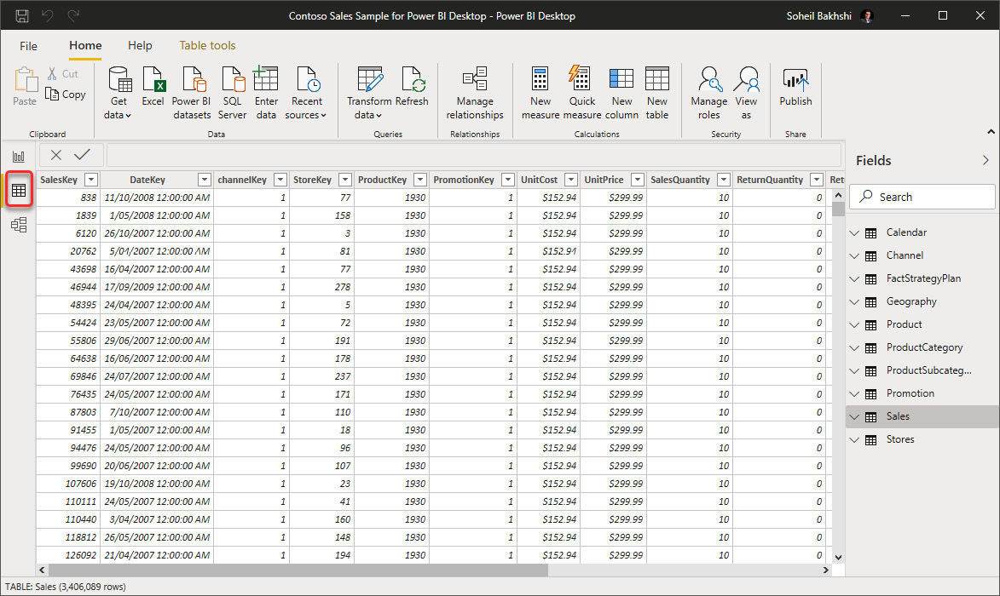

 

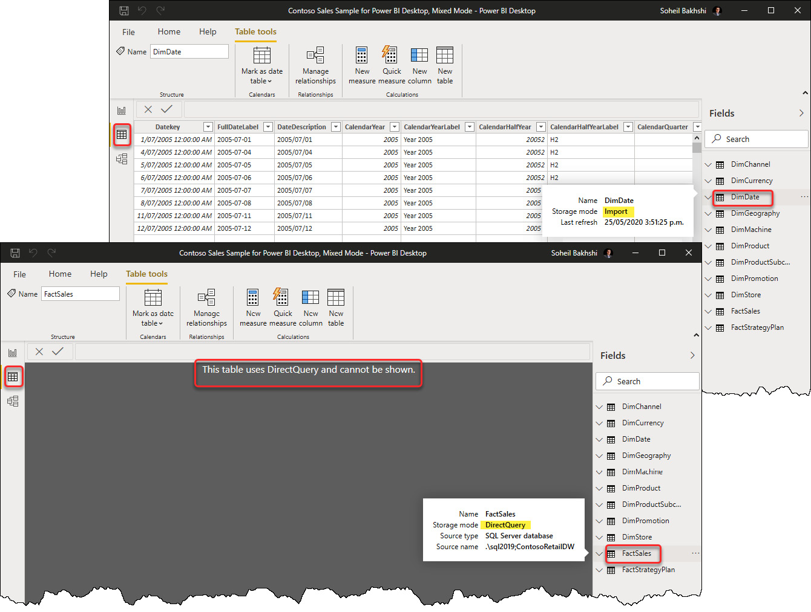

Như tên gọi của nó, trong **Model View** chúng ta có một tập hợp các bảng và các liên kết giữa chúng.

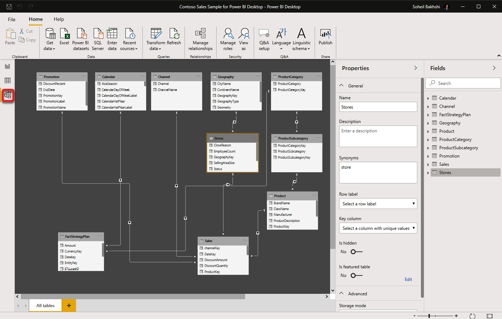

Điểm đến cuối cùng trong quy trình phân tích dữ liệu của chúng ta là <b>Data Visualization layer</b> <i>(Report view)</i>, đây là nơi chúng ta có thể thỏa sức sáng tạo với các biểu đồ và phân tích của mình.

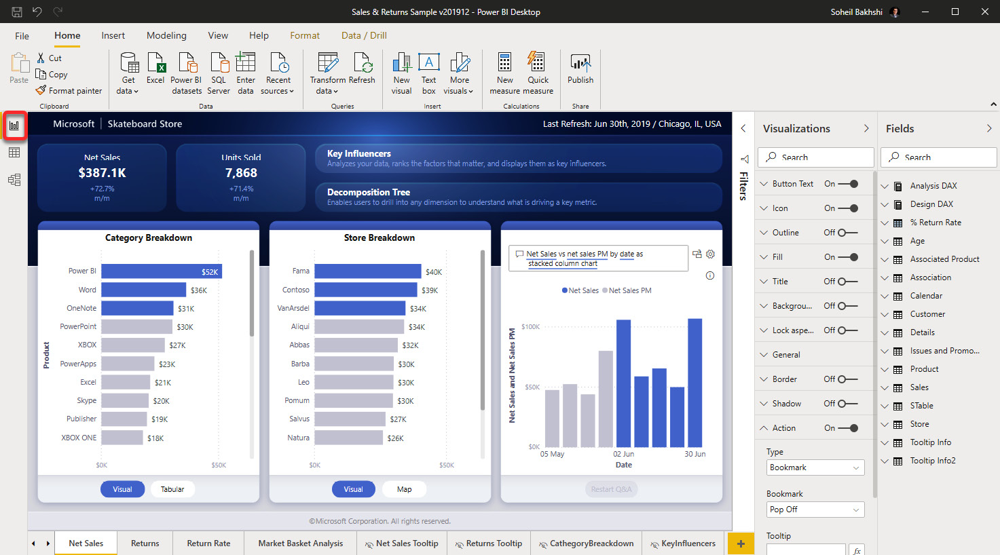

## 4. Các bước tạo data model

**Chuẩn bị dữ liệu**

- **Bước 1**: Import và transform data
- **Bước 2**: Merge và append các table để giảm số lượng các bảng trong data model.
- **Bước 3**: Đổi tên các bảng và columns để thân thiện hơn với người dùng.
- **Bước 4**: Xóa các columns không sử dụng đến.
- **Bước 5**: Chuyển đổi kiểu dữ liệu và formats dữ liệu của từng columns về dạng chuẩn.

**Tạo data model**

- **Bước 6**: Xác định và tạo mối liên kết giữa các bảng.
- **Bước 7**: Xác định filter direction giữa các bảng.

**Bổ sung thêm thêm thông tin cho data model**

- **Bước 8**: Tạo cấu trúc phân cấp _(hierarchies)_
- **Bước 9**: Tạo các bảng, cột và measures
- **Bước 10**: Ẩn các cột dữ liệu chỉ mang ý nghĩa liên kết giữa các bảng hoặc làm trung gian cho các tính toán mà không có nhiều ý nghĩa về mặt phân tích. ví dụ như các cột `id`.

## 5. Thực hành

Giả sử chúng ta có một bảng [dữ liệu](./data-modeling-simple.pbix) và _[data source](./data.zip)_ về dân số như sau:

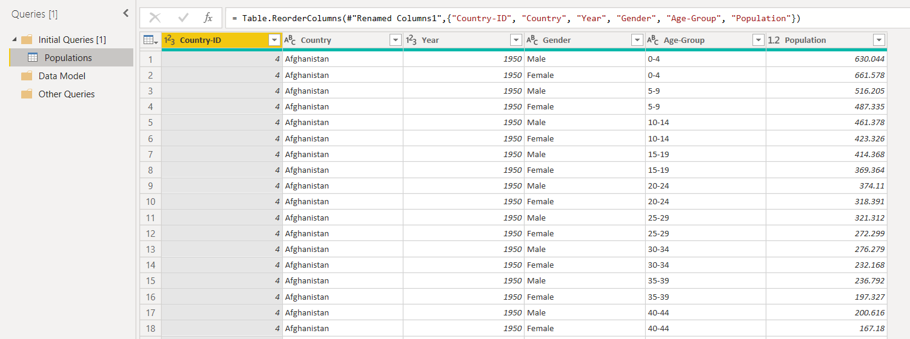

Bây giờ, chúng ta sẽ đi xác định và tạo các bảng Dim và bảng Fact. Để tạo một bảng mới từ một bảng đã có chúng ta có hai lựa chọn:

- **Duplicate**: với lựa chọn này thì Power Query sẽ sao chép toàn bộ queries trong bảng hiện tại, và bảng mới được tạo ra sẽ độc lập với bảng cũ.
- **Reference**: với lựa chọn này, Power Query sẽ tham chiếu đến bảng hiện tại. Điều đó có nghĩa là nếu bảng hiện tại bị sửa đổi thì bảng mới được tạo ra cũng sẽ bị thay đổi theo.

### 5.1. Tạo bảng Dim Region

Như các bạn có thể nhìn thấy trong hình ảnh trên, mình đã để <b>Populations</b> ở trong thư mục input, do đó mình sẽ sử dụng <b>reference</b> để tạo bảng mới. Đầu tiên sẽ là bảng <b>Dim Region</b>, đây là bảng gồm các thông tin về địa lý <b><i>(câu hỏi Where)</b></i>. Sau khi bảng <code>reference</code> được tạo ra, chúng ta sẽ đi xóa các cột không liên quan và vào <code>Remove Rows -> Remove Duplicates</code> để xóa các dòng trùng lặp vì các giá trị trong bảng Dim là duy nhất.

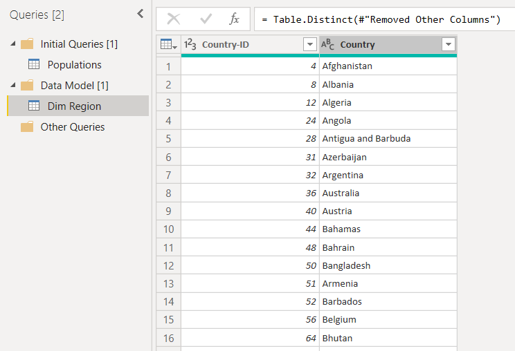

Tuy nhiên, bảng hiện tại của chúng ta còn thiếu một số thông tin mà chúng ta có thể bổ sung cho nó bằng cách lấy dữ liệu từ file [_codes-country_](./data/codes-country-region.txt).

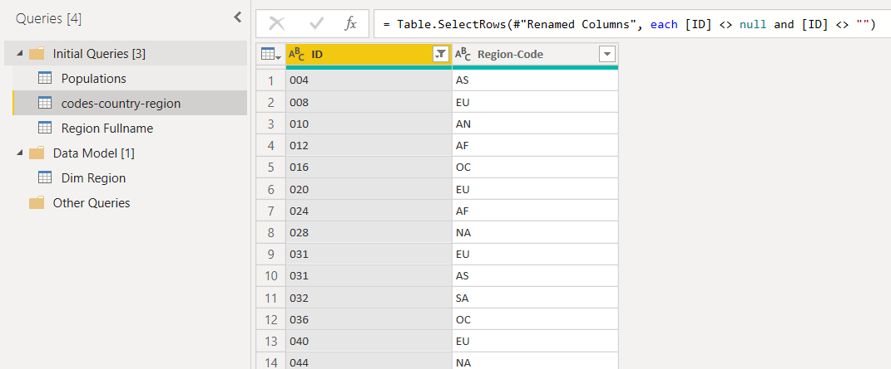

Chúng ta sẽ tạo thêm một bảng **`Region Fullname`** bằng cách nhập dữ liệu `Home -> Enter Data` với nội dung như sau:

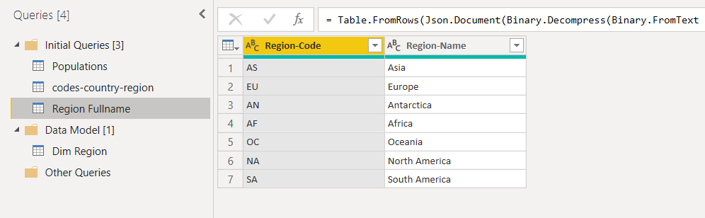

Bây giờ, chúng ta sẽ merge dữ liệu từ bảng **`Region Fullname`** vào bảng **`codes-country-region`**, sau đó thêm dữ liệu từ bảng **`codes-country-region`** vào bảng **`Dim Region`**

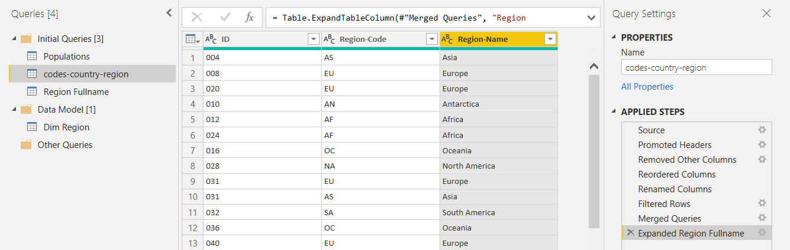

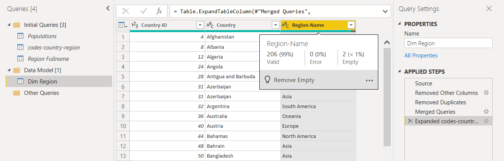

Ôi không, đã có một lỗi xảy ra trong quá trình Merge. Bảng **`codes-country-region`** đã bị thiếu dữ liệu:

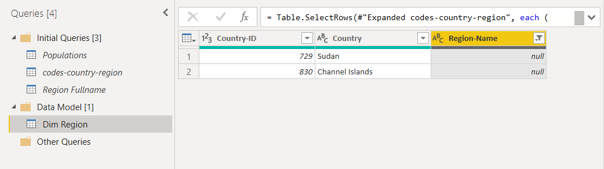

Ta phải tạo thêm một bảng mới, để Append dữ liệu vào **`codes-country-region`**.

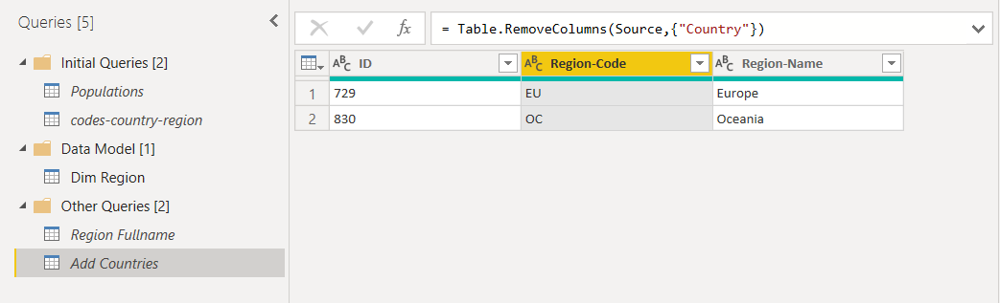

Sau khi thêm dữ liệu vào trong **`codes-country-region`**, các bạn nghĩ chúng ta đã xong chưa, thực ra là vẫn còn một vấn đề nữa. Hãy quay trở lại bảng **`codes-country-region`**, chọn column `ID` và vào `Keep Rows -> Keep Duplicates`

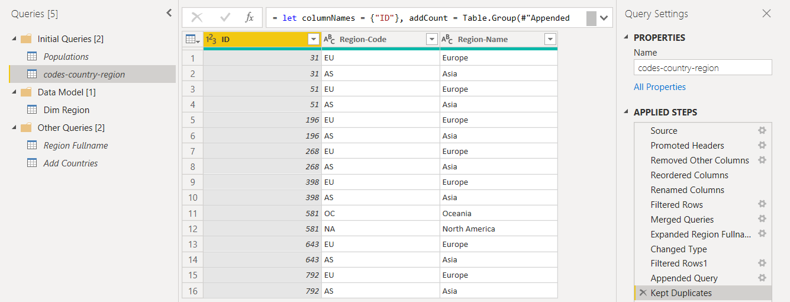

Trong thực tế, nếu gặp trường hợp này bạn sẽ phải đi tìm hiểu nguyên nhân gây ra lỗi và sửa lại nó. Tuy nhiên vì bài viết này chỉ mang tính minh họa, nên chúng ta sẽ `Remove Duplicates`

Đến đây là chúng ta đã hoàn thành xong bảng Dim đầu tiên, để thêm bảng này vào Data Model các bạn vào `File -> Apply`, ở đây chúng ta có một số lựa chọn:

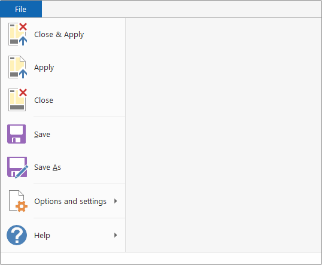

- **Close**: Thoát khỏi Power Query, dữ liệu được lưu trong Power Query, nếu data source bị hỏng _(ví dụ khi mở file ở một máy tính khác)_ thì các queries của chúng ta cũng gặp vấn đề.
- **Apply**: Thêm dữ liệu vào data model, tuy nhiên chúng ta vẫn còn ở trong giao diện của Power Query. Sau khi thêm dữ liệu vào data model thì dù dữ liệu ở Power Query có gặp vấn đề thì trong data model vẫn còn.
- **Close and Apply**: Kết hợp cả hai trường hợp trên.

**Lưu ý:** Với những bảng không thêm vào data model ta nên tắt tùy chọn `Enable load` của bảng đó đi:

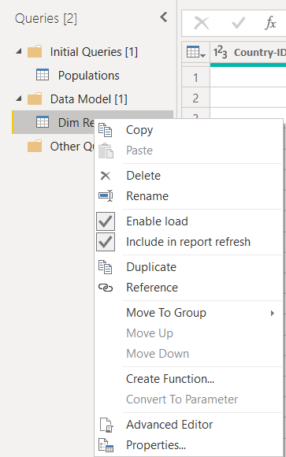

### 5.2. Tạo bảng Dim Age

Tương tự như phần trên, chúng ta sẽ tạo một bảng mới, xóa các cột không cần thiết và loại bỏ các giá trị duplicates:

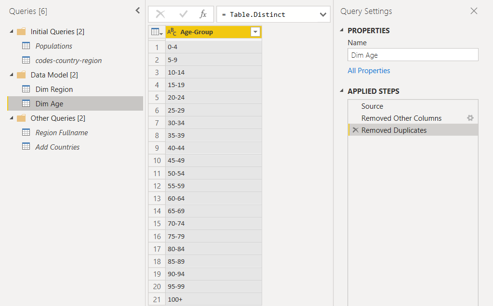

Có một vấn đề ở đây, đó là bảng **`Dim Age`** của chúng ta không có cột `ID`. Chúng ta có thể tạo ra một cột `ID` bằng cách vào `Add Column -> Index Column`.

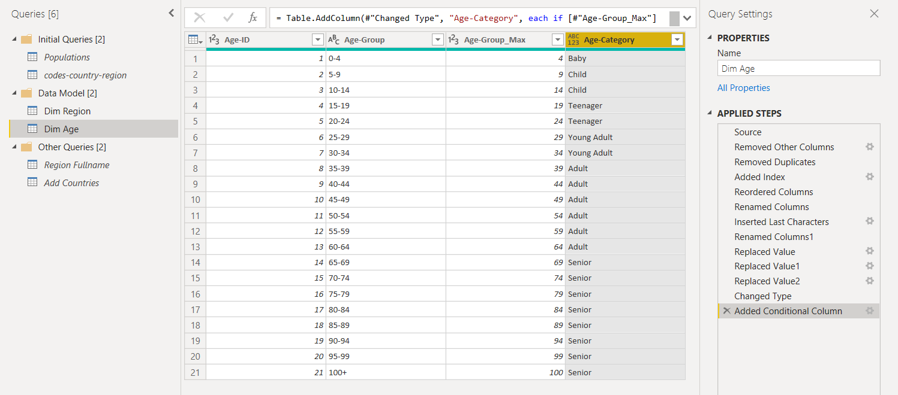

Tiếp theo chúng ta sẽ tạo thêm hai cột mới là `Age-Group_Max` sử dụng tính năng thêm cột bằng `Extract` và cột `Age-Category` sử dụng `Conditional Column`

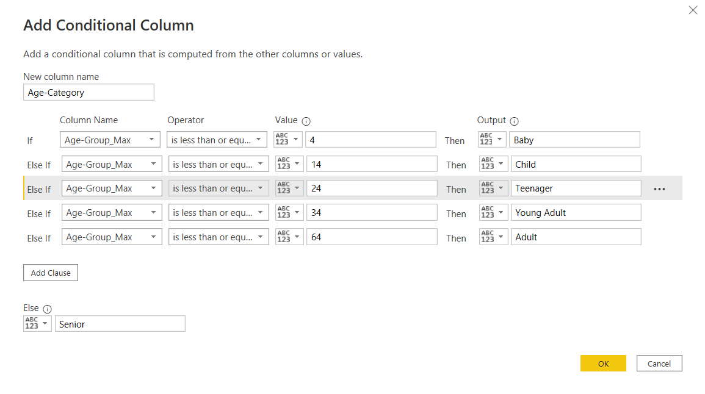

### 5.3. Tạo bảng Fact

Tương tự, chúng ta có một bảng mới tham chiếu đến bảng **`Populations`**, tuy nhiên vì đây là bảng Fact nên chúng ta không xóa các giá trị bị duplicates.

Vì bảng Fact của chúng ta chưa có cột `Age-ID` để có thể liên kết với bảng **`Dim Age`** do đó chúng ta sẽ sử dụng tính năng Merge để thêm cột này từ bảng **`Dim Age`** vào bảng Fact.

Cuối cùng thì xóa các cột không cần thiết và ta có kết quả:

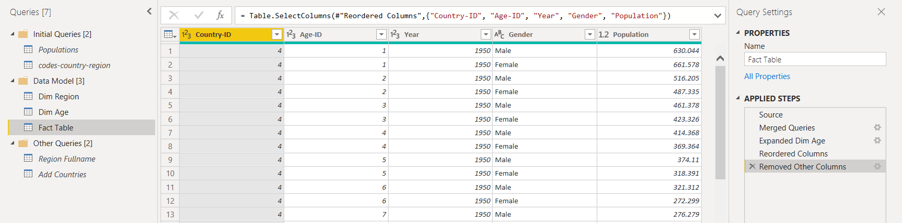

Các bạn có thể nhân cột `Population` với 1000, bằng cách vào `Transform -> Number Column -> Multiply` để tránh các hiểu nhầm về mặt tính toán nếu có vì tổng dân số là một số nguyên.

### 5.4. Tạo data model

Cho đến bây giờ, chúng ta đã có ba bảng dữ liệu như sau:

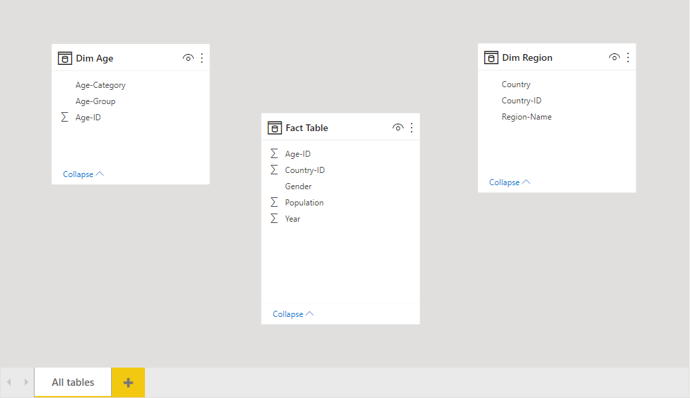

Như các bạn thấy, các bảng dữ liệu của chúng ta hiện tại đang trong trạng thái rời rạc. Do đó bước tiếp theo chúng ta phải làm là đi xác định và liên kết các bảng lại với nhau. Bước này khá đơn giản, các bạn có thể kéo thả các cột có sự liên kết với nhau từ bảng này qua bảng kia là hoàn thành.

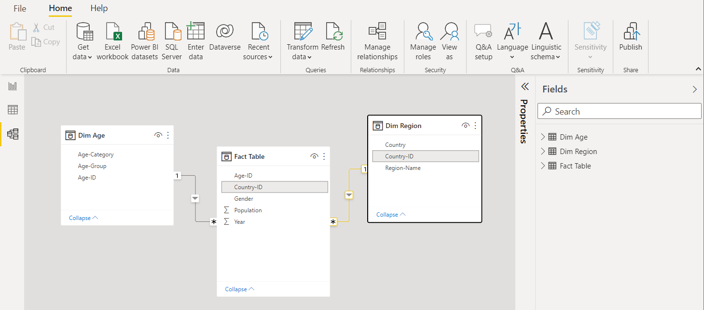

Hoặc sử dụng `Manage relationships`

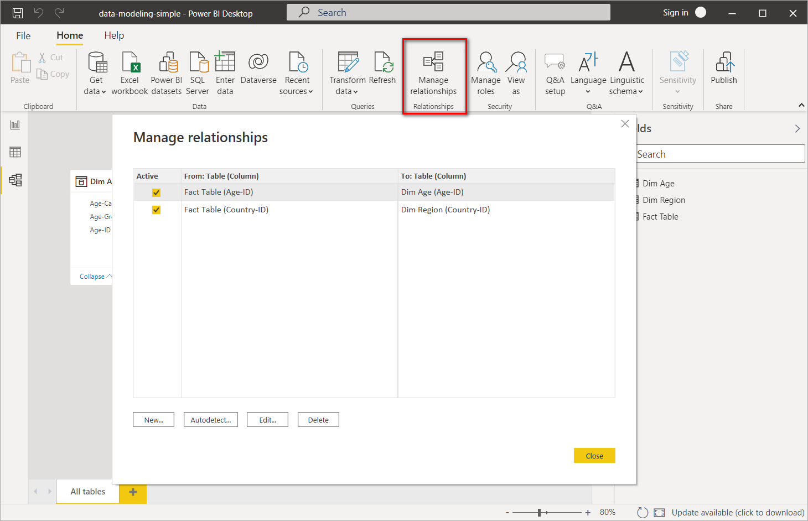

---