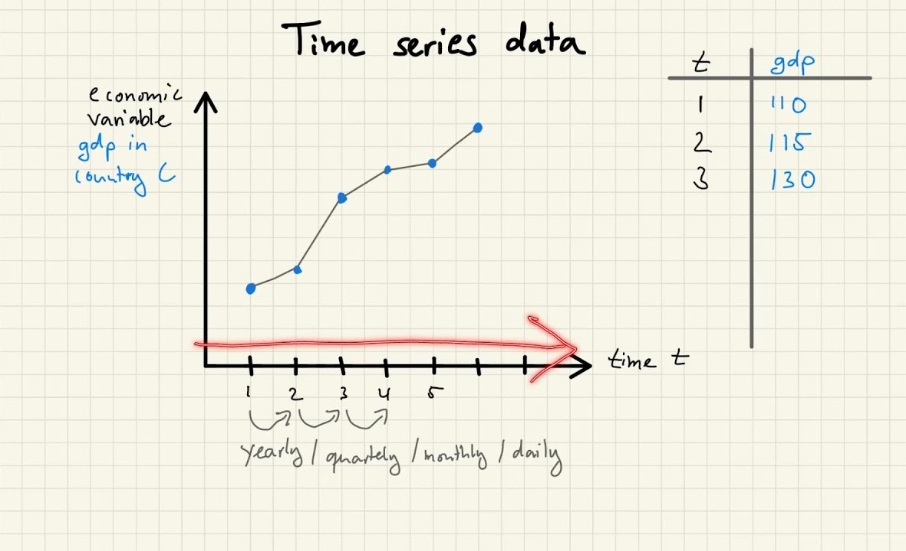
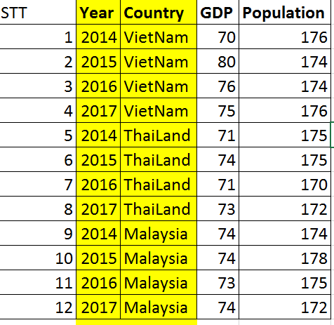
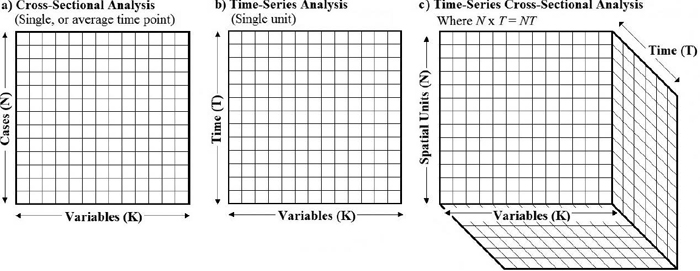
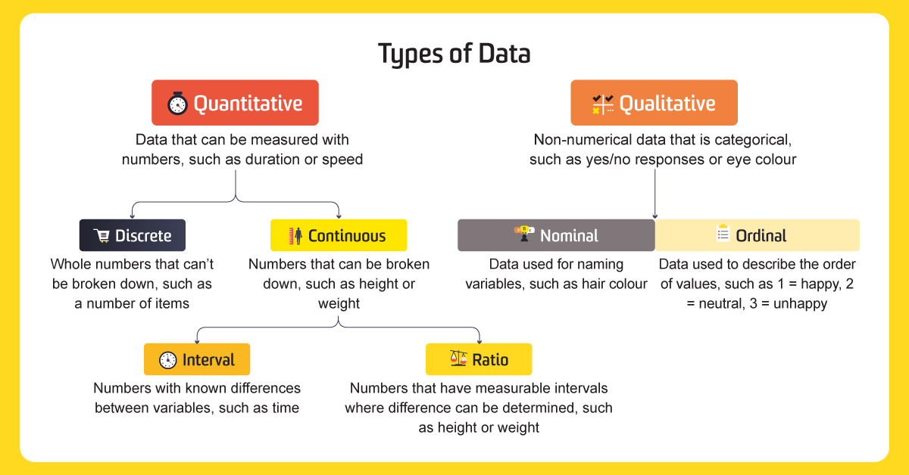
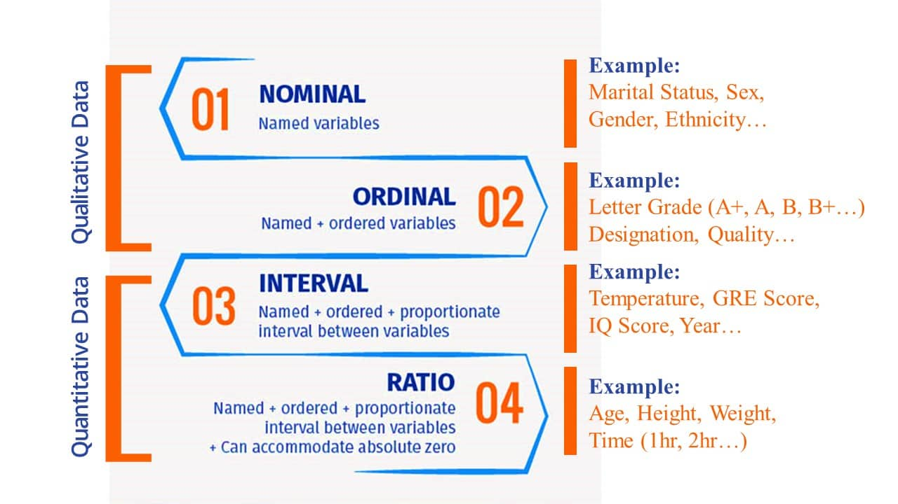

Trước khi đi vào phân tích dữ liệu, chúng ta cần phải hiểu được một số lý thuyết thống kê cơ bản, gồm có: thống kê mô tả, ước lượng khoảng tin cậy và kiểm định giả thuyết.

## 1. Structure of Data

### 1.1. Cross-sectional data

Dữ liệu chéo _(Cross-sectional data)_ là các dữ liệu thu thập được từ **nhiều đối tượng** trong **một khoảng thời gian** nhất định. Ví dụ:

- Điểm của các sinh viên vào cuối học kỳ hiện tại.
- Tiền lương của người lao động năm 2020 - bao gồm các biến như tiền lương, trình độ học vấn, giới tính, kinh nghiệm,...

### 1.2. Time series data

Dữ liệu chuỗi thời gian _(Time series data)_ là các quan sát về một hoặc nhiều biến theo thời gian. Ví dụ:

- Giá cổ phiếu, tỷ giá hối đoái.
- Chỉ số giá tiêu dùng (CPI), tổng sản phẩm trong nước (GDP).
- Doanh thu theo ngày, tháng, quý, năm của một công ty.

### 1.3. Panel data

Dữ liệu mảng _(Panel data)_ là kiểu dữ liệu kết hợp hai loại trên. Ví dụ vẫn là bảng dữ liệu về tiền lương của người lao động trong phần trên nhưng được thu thập trong nhiều năm, chứ không phải chỉ riêng năm 2020. Một ví dụ khác:

Các bạn có thể tưởng tượng dữ liệu chéo và dữ liệu chuỗi thời gian là dữ liệu ở dạng 2 chiều, còn dữ liệu mảng thì ở dạng 3 chiều.

## 2. Types of Data

Trong quá trình thu thập dữ liệu, với mỗi biến chúng ta phải quyết định xem nên sử dụng thang đo gì với biến đó. Thang đo sẽ quyết định lượng thông tin được chứa trong các biến và cách chúng ta tóm tắt và lựa chọn các chart, phương pháp phân tích thống kê phù hợp nhất.

Cấp độ phân chia đầu tiên, dữ liệu được chia làm hai nhóm:

- Dữ liệu định tính _(Categorical, quanlitative)_
- Dữ liệu định lượng _(Numerical, quantitative)_

### 2.1. Dữ liệu định tính

Dữ liệu định tính là dữ liệu liên quan đến mô tả, chúng ta có thể quan sát nhưng không thể đo lường được bằng các con số. Dữ liệu định tính thường là các nhãn, tên dùng để phản ánh tính chất, sự hơn kém hoặc phân loại các phần tử. Ví dụ như giới tính, màu sắc,...

### 2.2. Dữ liệu định lượng

Dữ liệu định lượng là dữ liệu mà chúng ta có thể sử dụng các con số để miêu tả mức độ của các quan sát. Ví dụ như khoảng cách, chiều dài, tốc độ, trọng lượng...

Dữ liệu định lượng lại được chia làm hai loại: Rời rạc và liên tục.

Dữ liệu rời rạc <i>(discrete)</i>: hiểu đơn giản là những dữ liệu được miêu tả bằng các số nguyên, giá trị rời rạc, hữu hạn. Ví dụ số lượng con mèo của một shop bán pet, ta có thể có 2 con mèo, ba con mèo, nhưng không thể nào có 2.5 con mèo được. Số nhà bán được trong một tháng cũng tương tự, chúng ta có thể bán được một cái nhà, hai cái nhà nhưng làm sao có thể bán nửa cái nhà.

Dữ liệu liên tục <i>(continuous)</i>: là dữ liệu mà các giá trị miêu tả có thể chia nhỏ thành các phần thập phân. Ví dụ như chiều cao hoặc cân nặng. Thời gian cũng có thể chia nhỏ thành nửa giây, nửa phút, nửa giờ.

### 2.3. Bốn loại thang đo

Dữ liệu định tính sử dụng hai loại thang đo:

- Thang đo định danh _(Nominal)_
- Thang đo thứ bậc _(Ordinal)_

Dữ liệu định lượng sử dụng hai loại thang đo:

- Thang đo khoảng _(Interval)_
- Thang đo tỷ lệ _(Ratio)_

Khi dữ liệu của một biến bao gồm các nhãn hoặc tên được sử dụng để phân biệt một thuộc tính của phần tử, thang đo này được gọi là <b>thang đo định danh</b>. Ví dụ, thị trường chứng khoán <i>(New York = 1, Nasdaq = 2)</i>, thì 1 và 2 là các nhãn trong đó 1 đại diện cho thị trường chứng khoán New York, còn 2 thì biểu thị cho thị trường chứng khoán Nasdaq. Trong trường hợp này, 1 và 2 là các nhãn phân biệt nơi cổ phiếu được giao dịch.

Thang đo, đối với một biến được gọi là <b>thang đo thứ bậc</b> nếu dữ liệu thể hiện tính chất của dữ liệu danh nghĩa và thứ tự hoặc xếp hạng của dữ liệu này có ý nghĩa. Ví dụ sự hài lòng của khách hàng <i>(xuất sắc, tốt, kém)</i>.

Thang đo, đối với một biến là <b>thang đo khoảng</b> nếu dữ liệu có tất cả các thuộc tính của <b>thang đo thứ bậc</b> và khoảng cách giữa các giá trị được thể hiện dưới dạng đơn vị đo lường cố định có ý nghĩa. Ví dụ ba học sinh với điểm <i>(SAT)</i> là <code>620, 550</code> và <code>470</code> có thể được xếp hạng theo thứ tự từ thành tích tốt nhất đến kém nhất. Ngoài ra chênh lệch giữa các điểm số cũng có ý nghĩa.

Thang đo, đối với một biến là <b>thang đo tỷ lệ</b> nếu dữ liệu có tất cả các đặc tính của <b>thang đo khoảng</b> và tỷ lệ của hai giá trị có ý nghĩa. Ví dụ các biến như khoảng cách, chiều cao, trọng lượng, thời gian,...Thang đo này đòi hỏi một giá trị <code>0</code> đúng nghĩa, nghĩa là tại giá trị <code>0</code> không có gì tồn tại trong biến. Ví dụ chi phí của một ô tô, một giá trị <code>0</code> cho chi phí cho biết ô tô này là miễn phí.

## 3. Descriptive Statistics

## 4. Inferential Statistics

## 5. Confidence Intervals

## 6. Hypothesis Testing
