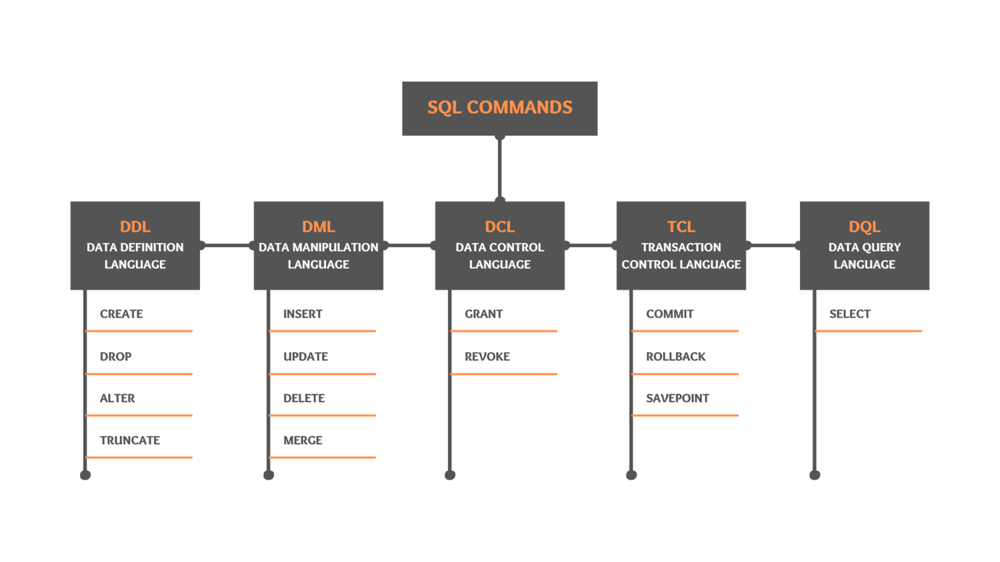
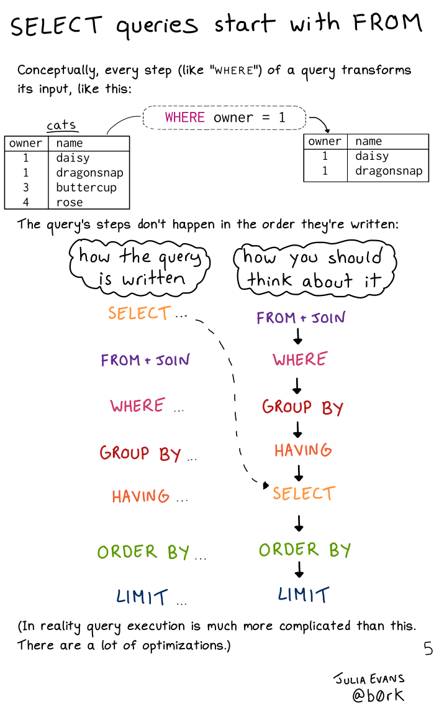
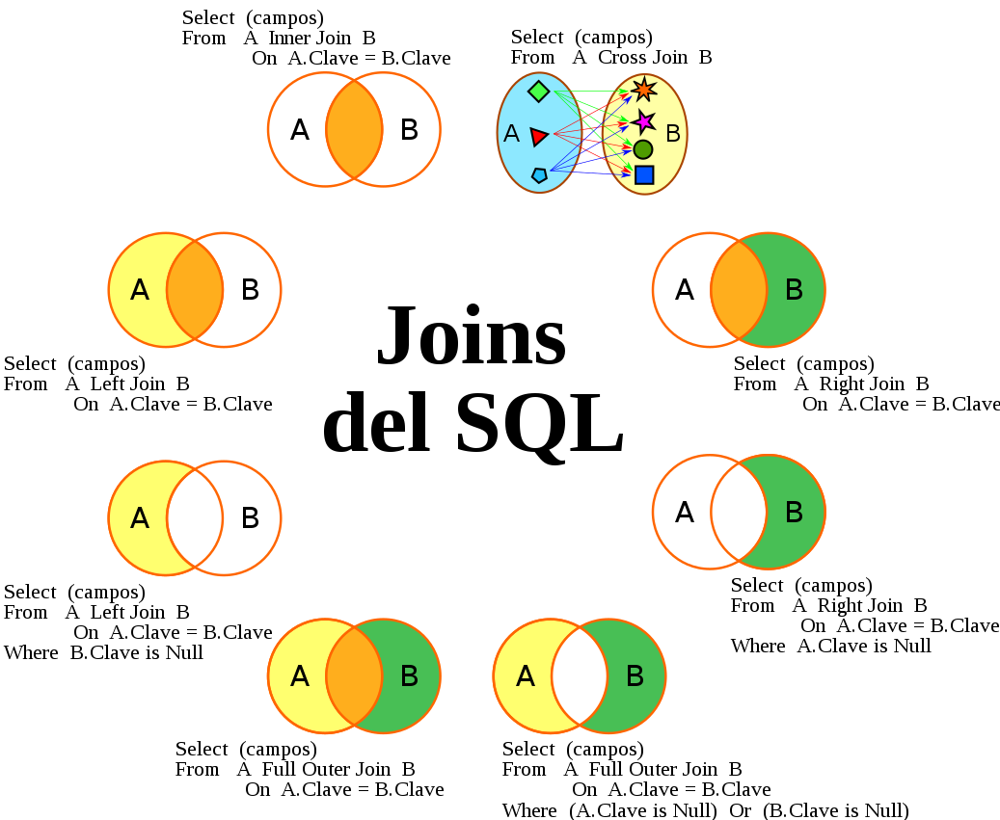
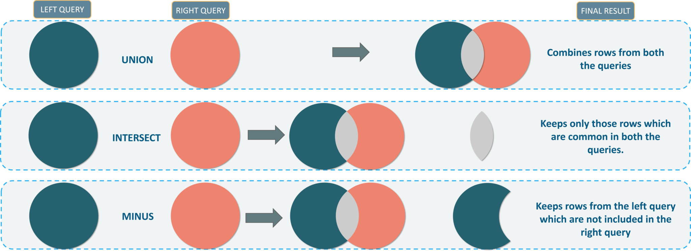
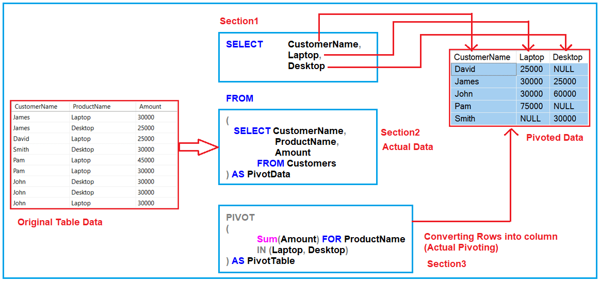
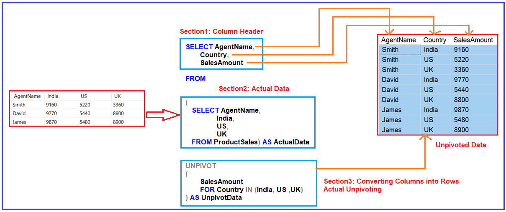

Sau khi nắm được các kiến thức cơ bản về CSDL trong bài trước, tiếp theo chúng ta sẽ đi làm quen với các câu lệnh truy vấn cơ bản `SELECT, FROM, WHERE`.

## 1. Data Definition Language

DDL ta có thể hiểu đơn giản là các câu lệnh giúp chúng ta tạo, sửa đổi hoặc xóa các đối tượng CSDL như _databases, tables, views, functions_...

### 1.1. CREATE TABLE

Cú pháp:

```sql
-- Tạo bảng
CREATE TABLE table_name(
  column_name constraints,
  CONSTRAINT 
);

-- Ví dụ
CREATE TABLE IF NOT EXISTS STAFF
(
    STAFF_ID         VARCHAR(20)
  , STAFF_TYPE       VARCHAR(30)
  , SCHOOL_ID        VARCHAR(20)
  , FIRST_NAME       VARCHAR(100) NOT NULL
  , LAST_NAME        VARCHAR(100) NOT NULL
  , AGE              INT
  , DOB              DATE
  , GENDER           VARCHAR(10) CHECK (GENDER IN ('M', 'F', 'Male', 'Female'))
  , JOIN_DATE        DATE
  , ADDRESS_ID       VARCHAR(20)
  , CONSTRAINT PK_STAFF PRIMARY KEY(STAFF_ID)
  , CONSTRAINT FK_STAFF_SCHL FOREIGN KEY(SCHOOL_ID) REFERENCES SCHOOL(SCHOOL_ID)
  , CONSTRAINT FK_STAFF_ADDR FOREIGN KEY(ADDRESS_ID) REFERENCES ADDRESS(ADDRESS_ID)
);
```

### 1.2. Data Type

Một số kiểu dữ liệu phổ biến:

- **VARCHAR**: Kiểu ký tự bao gồm các ký tự alphabets, numbers, alphanumeric và một số ký tự đặc biệt.
- **INT**: Kiểu dữ liệu số nguyên.
- **FLOAT**: Kiểu dữ liệu số thực.
- **DATE**: Kiểu ngày tháng năm.
- **BOOLEAN**: Kiểu dữ liệu chỉ có hai giá trị _(TRUE = 1, FALSE = 0)_.

### 1.3. Constraints

Constraints là các ràng buộc áp dụng cho các giá trị trong một cột. Hiểu nôm na là các giá trị khi nhập vào phải thỏa mãn một hoặc một số điều kiện nào đó. Một số constraints phổ biến:

- **CHECK**: Cho phép kiểm soát các giá trị được nhập vào một cột.
- **NOT NULL**: Cột không được có giá trị Null.
- **UNIQUE**: Các giá trị trong cột là duy nhất, không được phép lặp lại.
- **PRIMARY KEY**: Chỉ định cột khóa chính. Cột khóa chính là cột _(NOT NULL & UNIQUE)_.
- **FOREIGN KEY**: Chỉ định cột khóa ngoại, đây là cột xác định mối quan hệ giữa các bảng với nhau.

### 1.4. ALTER

ALTER thường được sử dụng để sửa cấu trúc của các Table hiện có:

```sql
ALTER TABLE <Table_Name> DROP COLUMN <Column_Name>; -- Drop a column.
ALTER TABLE <Table_Name> ADD COLUMN <Column_Name> VARCHAR(100); -- Add new column.
ALTER TABLE <Table_Name> ALTER COLUMN <Column_Name> TYPE VARCHAR(1); -- Change data type of a column.
ALTER TABLE <Table_Name> RENAME COLUMN <Column_Name> TO <New_Column_Name>; -- Rename a column.
ALTER TABLE <Table_Name> ADD CONSTRAINT <Constraint_Name> UNIQUE (<Column_Name>); -- Add new constraint
ALTER TABLE <Table_Name> DROP CONSTRAINT <Constraint_Name>; -- Drop a constraint.
ALTER TABLE <Table_Name> RENAME TO <New_Table_Name>; -- Rename a table.
```

### 1.5. DELETE, TRUNCATE, DROP

Về cơ bản 3 lệnh này được sử dụng để xóa dữ liệu, trong đó:

- **DELETE**: Xóa các dòng trong bảng theo một điều kiện nào đó. Dữ liệu có thể phục hồi.
- **TRUNCATE**: Xóa tất cả các dòng trong bảng khỏi bộ nhớ, không thể phục hồi lại.
- **DROP**: Xóa một bảng khỏi database.

```sql
-- DELETE
DELETE FROM ten_bang; -- Xóa bảng

-- TRUNCATE
TRUNCATE TABLE ten_bang

-- DROP
DROP TABLE ten_bang;
```

## 2. Data Manipulation Language

DML được sử dụng để nhập, sửa hoặc xóa dữ liệu từ databases. Nghĩ theo một hướng khác, thì DDL được sử dụng để tương tác với _Tables_ và _Columns_, còn DML thì được sử dụng để tương tác với các _Record_.

### 2.1. INSERT

Câu lệnh INSERT dùng để nhập dữ liệu vào Tables:

```sql
-- Nhập dữ liệu cơ bản
INSERT INTO table_name (column_list)
VALUES
    (value_list_1),
    (value_list_2),
    ...
    (value_list_n);

-- Nhập dữ liệu từ câu lệnh Select
INSERT INTO table_name (column1, column2, … )
SELECT expression_1, expression_2, …
FROM source_tables
WHERE conditions;
```

### 2.2. UPDATE

Câu lệnh UPDATE dùng để sửa dữ liệu trong Tables:

```sql
-- Sửa một giá trị trong các cột 
UPDATE table_name
SET column_name_1 = new_value, column_name_2 = new_value
WHERE <conditional>
```

### 2.3. DELETE

DELETE dùng để xóa các hàng dữ liệu thỏa mãn một điều kiện nào đó.

```sql
-- xóa các hàng dữ liệu
DELETE FROM table_name WHERE conditional;
```

## 3. Câu lệnh SELECT

### 3.1. Cú pháp cơ bản

```sql
-- Cú pháp cơ bản
SELECT <column_name> [AS new_name]  -- Lấy ra các cột, SELECT DISTINCT, SELECT TOP
FROM <table_name>                   -- Từ một bảng nào đó
WHERE <conditional>                 -- Sau đó lọc ra các record thỏa mãn điều kiện nào đó
ORDER BY <column_name> [DESC];      -- Sắp xếp các giá trị tăng dần

-- Mở rộng với GROUP BY và HAVING
SELECT <column_name>     -- Lấy ra các cột
FROM <table_name>        -- Từ một bảng nào đó
WHERE <conditional>      -- Sau đó lọc ra các record thỏa mãn điều kiện nào đó
GROUP BY <column_name>   -- Gom nhóm
HAVING <agregate_filter> -- Hàm lọc các nhóm thỏa mãn điều kiện nào đó
ORDER BY <column_name>   -- Sắp xếp các giá trị tăng dần, DESC giảm dần
LIMIT n;                 -- Lấy ra n bản ghi đầu tiên, trong SQL Server là SELECT TOP n  
```

Thứ tự thực hiện các câu lệnh trong SQL:



### 3.2. Toán tử

- Các toán tử cơ bản: _+, -, *, /, % (chia lấy phần dư)_
- Các toán tử so sánh: _=, !=, <, <=, >, >=_
- Các toán tử logic: _AND, OR, NOT, BETWEEN...AND_
- Toán tử làm việc với text: _LIKE 'string'_
- Toán tử làm việc với list: _IN, NOT IN (value1, value2,...)_
- Một số toán tử khác: _AS, TOP or LIMIT_

### 3.3. Patterns

- Ký tự `%`: Đại diện cho chuỗi ký tự có độ dài bất kỳ.
- Ký tự `_`: Đại diện cho một ký tự.
- Ký tự `[danh sách ký tự]`: Bất kỳ ký tự nào trong danh sách chỉ định.
- Ký tự `[ký tự - ký tự]`: Bất kỳ ký tự nào trong phạm vi chỉ đinh.
- Ký tự `[^]`: Bất kỳ ký tự nào ngoài danh sách.

Ngoài các ký tự trên, còn ký tự `ESCAPE`:

```sql
-- Ký tự được khai báo có thể sử dụng như ký tự escape
LIKE pattern [ESCAPE escape_character]
```

### 3.4. CASE WHEN

```sql
-- SELECT CASE WHEN
SELECT <column_list>, 
CASE 
      WHEN condition_1  THEN result_1
      WHEN condition_2  THEN result_2
      [WHEN ...]
      [ELSE else_result]
END
FROM
WHERE 
```

```sql
-- CASE expression
SELECT <column_list>, 
CASE expression
   WHEN value_1 THEN result_1
   WHEN value_2 THEN result_2 
   [WHEN ...]
ELSE
   else_result
END
FROM
WHERE 
```

## 4. Câu lệnh JOINs

### 4.1. Một số loại Joins

JOINs được sử dụng để giúp chúng ta lấy dữ liệu từ nhiều bảng.



### 4.2. Một số lưu ý

```sql
-- Lấy một cột cụ thể từ các bảng, ví dụ
SELECT  accounts.name,
        orders.occurred_at
FROM orders
JOIN accounts
ON orders.account_id = accounts.id;

-- Lấy tất cả các cột
SELECT *
FROM orders
JOIN accounts
ON orders.account_id = accounts.id;

-- Lấy tất cả các cột trong một bảng
SELECT orders.*
FROM orders
JOIN accounts
ON orders.account_id = accounts.id;

-- Chúng ta có thể đặt bí danh cho các bảng
FROM tablename AS t1
JOIN tablename2 AS t2

FROM tablename t1
JOIN tablename2 t2
```

### 4.3. SELF JOIN

SELF JOIN cho phép ta Join một bảng với chính nó. 

```sql
-- Sử dụng 2 alias khác nhau cho cùng một bảng 
SELECT
    select_list
FROM
    Table_name t1
[INNER | LEFT]  JOIN Table_name t2 ON
    join_predicate; 
```

### 4.4. Set Operators

```sql
query1 UNION [ALL] query2      -- Phép hợp
query1 INTERSECT [ALL] query2  -- Phép giao
query1 EXCEPT [ALL] query2     -- Phép trừ
```



## 5. Aggregations

### 5.1 NULL

Trước khi đi tìm hiểu về các hàm tổng hợp dữ liệu, chúng ta cần phải quan tâm đến các giá trị NULL. NULL là một kiểu dữ liệu mang ý nghĩa không tồn tại dữ liệu trong SQL. Chúng thường bị bỏ qua trong các hàm tổng hợp.

Khi sử dụng NULL trong mệnh đề WHERE, ta sử dụng `IS NULL` hoặc `IS NOT NULL` chứ không sử dụng dấu `=`. 

### 5.2. Một số hàm tổng hợp dữ liệu

- **COUNT()**: Đếm số hàng có dữ liệu trong bảng, COUNT bỏ qua NULL.
- **COUNT(DISTINCT )**: Đếm số lượng các giá trị riêng biệt trong một cột.
- **SUM()**: Tính tổng các giá trị trong một cột, bỏ qua NULL.
- **AVG()**: Tính giá trị trung bình, bỏ qua NULL.
- **MEDIAN()**: Tính giá trị trung vị, bỏ qua NULL
- **MAX()**: Xác định giá trị lớn nhất, ngày lớn nhất hoặc giá trị không phải số gần "Z" trong bảng alphabet.
- **MIN()**: Ngược lại với MAX.

Lưu ý: Bất kỳ cột nào trong mệnh đề **SELECT** không nằm trong các hàm aggregation thì phải nằm trong mệnh đề **GROUP BY**.

### 5.3. DISTINCT

**DISTINCT** luôn nằm trong mệnh đề **SELECT**. 

```sql
-- Giá trị duy nhất của cả 3 cột
SELECT DISTINCT column1, column2, column3 
FROM table1;
```

Khi gặp giá trị **NULL, DISTINCT** sẽ giữ lại một giá trị **NULL**, các giá trị còn lại sẽ bị xóa.

### 5.4. PIVOT trong SQL Server

Cú pháp:

```sql
-- PIVOT
SELECT <non-pivoted column>,  
    [first pivoted column] AS <column name>,  
    [second pivoted column] AS <column name>,  
    ...  
    [last pivoted column] AS <column name>  
FROM  
    (<SELECT query that produces the data>)   
    AS <alias for the source query>  
PIVOT  
(  
    <aggregation function>(<column being aggregated>)  
FOR   
[<column that contains the values that will become column headers>]   
    IN ( [first pivoted column], [second pivoted column],  
    ... [last pivoted column])  
) AS <alias for the pivot table>  
<optional ORDER BY clause>;
```

Ví dụ:





---