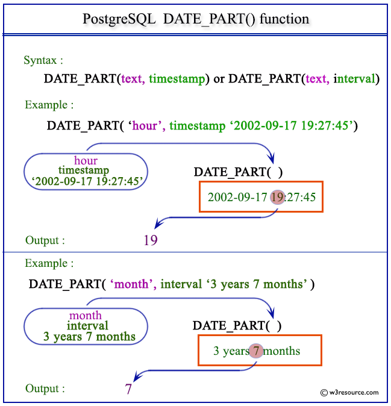
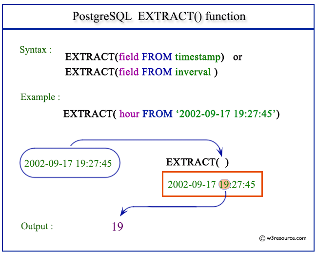
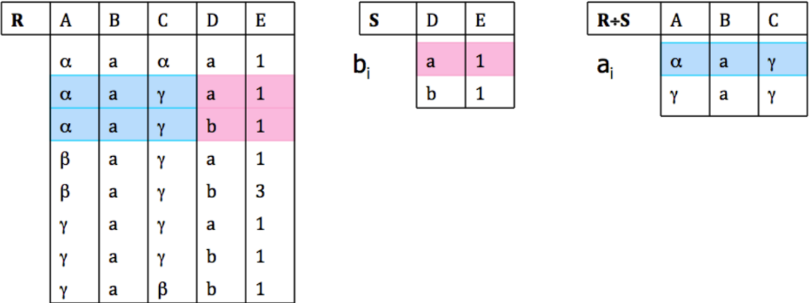
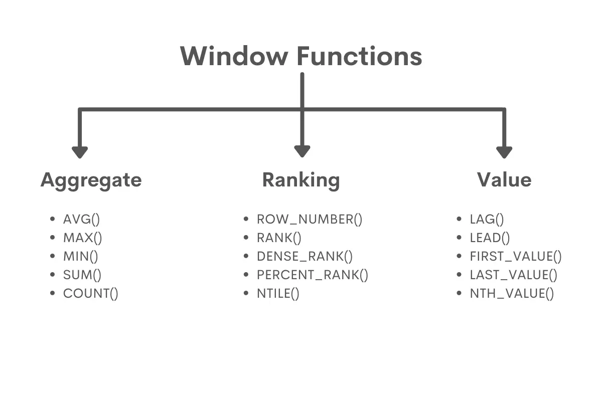
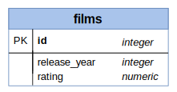
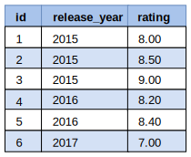
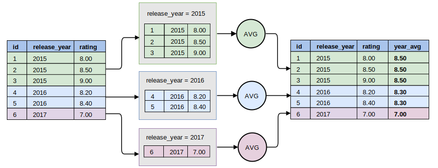
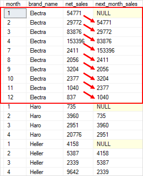
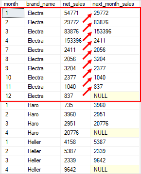

## 1. Xử lý dữ liệu Date

### 1.1. DATE_PART và EXTRACT

Hai hàm này được sử dụng để trích xuất các thành phần từ kiểu dữ liệu datetime, điểm khác là `DATE_PART` là hàm của Postgresql còn `EXTRACT` là hàm áp dụng được cho nhiều DBMS:

```sql
-- Cú pháp:
DATE_PART(unit, source)
EXTRACT(unit FROM source)

-- Unit:
-- year, month, day
-- quarter, week
-- hour, minute, second
-- dow (0 - 6; Sunday is 0), doy (1 - 365/366)
```





### 1.2. INTERVAL

**INTERVAL** được sử dụng để thêm hoặc bớt một khoảng thời gian đối với các dữ liệu datetime.

```sql
-- INTERVAL text
INTERVAL '6 years 5 months 4 days 3 hours 2 minutes 1 second';
```

### 1.3. TO_DATE

Hàm này được sử dụng để chuyển đổi một chuỗi ký tự thành datetime.

```sql
-- Cú pháp
TO_DATE(string, format_of_str)

-- Ví dụ
TO_DATE('20020304', 'YYYYMMDD')
TO_DATE('2015/06/07', 'YYYY/MM/DD')
TO_DATE('10 Feb 2017', 'DD Mon YYYY')
```

## 2. Xử lý dữ liệu Text

### 2.1. LEFT, RIGHT, LENGTH

Các hàm `LEFT()` và `RIGHT()` được sử dụng để trích xuất một phần số ký tự từ string. Còn hàm `LENGTH()` để đo độ dài của string.

```sql
-- Cú pháp
LEFT(string, number of characters)
RIGHT(string, number of characters)

-- Substring ở một vị trí xác định với độ dài length
SUBSTR(string, start, length) 

-- Độ dài của một chuỗi
LENGTH(string)
```

Hàm `TRIM()` được sử dụng để xóa một hoặc một số ký tự ở hai đầu của string.

```sql
-- Cú pháp 
-- Hàm TRIM gồm 3 thành phần:
-- Vị trí xóa: the beginning ('leading'), the end ('trailing'), or both ('both')
-- 'chrs': Tập hợp các ký tự
-- FROM column_Name: Tên cột
-- Ví dụ:
TRIM(both '()' FROM column_name)
```

### 2.2. POSITION và STRPOS

Hàm `POSITION` và `STRPOS` xác định vị trí đầu tiên xuất hiện của substring trong một chuỗi, lưu ý là cả hai hàm có phân biệt giữa các ký tự in hoa và in thường. Điểm khác nhau ở cú pháp:

```sql
-- POSITION
POSITION(substr IN colum_name)

-- STRPOS
STRPOS(column_Name, substr)
```

### 2.3. LOWER và UPPER

Hàm `UPPER` và `LOWER` chuyển đổi một chuỗi các ký tự về dạng in hoa hoặc in thường.

### 2.4. CONCAT

Hàm `CONCAT` nối các ký tự. 

```sql
-- Sử dụng hàm CONCAT
CONCAT(day_of_week, ', ', LEFT(date, 10))

-- Sử dụng toán tử ||
day_of_week || ', ' || LEFT(date, 10)
```

### 2.5. CAST

Hàm `CAST` chuyển đổi một giá trị sang một kiểu dữ liệu khác.

```sql
-- Sử dụng hàm CAST
CAST(expression AS target_type)

-- Sử dụng toán tử ::
expression::type
```

### 2.1. COALESCE

Hàm `COALESCE` trả về biểu thức có giá trị khác NULL đầu tiên:

```sql
-- Cú pháp
COALESCE(express_1,[express_2,...,express_n])

-- Sử dụng COALESCE thay thế NULL bởi NA
COALESCE(column_name, 'N/A')
```

## 3. Subqueries

Subqueries hiểu đơn giản là một truy vấn bên trong một truy vấn khác. Một số loại Subqueries thường gặp:

- Subqueries thay thế cho một biểu thức, trả về một giá trị duy nhất.
- Subqueries với toán tử `IN` hoặc `NOT IN`
- Subqueries với toán tử `ANY` hoặc `ALL`
- Subqueries với toán tử `EXISTS` hoặc `NOT EXISTS`
- Subqueries trong mệnh đề `FROM`, phải có Alias.
- Subqueries tương quan.

### 3.1. IN và NOT IN

```sql
scalar_expression IN (subquery)
```

Truy vấn con được trả về một tập hợp các giá trị. Sau đó chương trình sẽ lọc ra các giá trị bên trong `scalar_expression` nằm trong truy vấn con.

Lưu ý khi subqueries chứa giá trị `NULL`, `NOT IN` có thể xử lý không chính xác.

### 3.2. ANY hoặc ALL

```sql
scalar_expression comparison_operator ANY|ALL (subquery)
```

Với `ANY`, giả sử truy vấn con trả về một danh sách có giá trị `V1, V1,..., Vn`. Toán tử `ANY` trả về TRUE nếu một trong các cặp so sánh (`scalar_expression`, `Vi`) trả về `TRUE`. Với toán tử `ALL` thì cần phải thỏa mãn tất cả các cặp so sánh đều trả về `TRUE`.

### 3.3. EXISTS và NOT EXISTS

```sql
WHERE [NOT] EXISTS (subquery)
```

Toán tử `EXISTS` sẽ trả về `TRUE` kết quả nếu subqueries trả về kết quả.

### 3.4. Subquery tương quan

Subquery tương quan là một truy vấn con sử dụng các giá trị của truy vấn bên ngoài. Một truy vấn tương quan sẽ được thực thi lặp đi lặp lại. Với mỗi hàng ở truy vấn bên ngoài, truy vấn con được lặp lại một lần.


### 3.5. Phép chia

Giả sử ta có một bảng như sau:



Ta có thể hiểu đơn giản là tìm những record `A, B, C` trong bảng _**R**_ sao cho, `A, B, C` kết hợp với tất cả các record `D, E` trong bảng _**S**_ vẫn nằm trong _**R**_.

Có hai cách để giải bài toán này, cách 1 sử dụng `EXCEPT`:

```sql
SELECT R1.A, R1.B, R1.C FROM R R1
WHERE NOT EXISTS (
                  SELECT S.D, S.E 
                  FROM S
                  EXCEPT
                  SELECT R2.D, R2.E 
                  FROM R R2
                  WHERE R1.A=R2.A AND R1.B=R2.B AND R1.C=R2.C
                  )
```

Cách 2, sử dụng `NOT EXIST`:

```sql
SELECT R1.A, R1.B, R1.C
FROM R R1
WHERE NOT EXISTS (
       SELECT *
       FROM S
       WHERE NOT EXISTS (
           SELECT *
           FROM R R2
           WHERE R2.D=S.D AND R2.E=S.E
           AND R1.A=R2.A AND R1.B=R2.B AND R1.C=R2.C ))
```

## 4. Temporary Tables

### 4.1. Mệnh đề WITH

WITH hay đôi khi còn được gọi với cái tên khác là _CTE (Command Table Expression)_. Hiểu đơn giản thì nó cho phép ta lưu kết quả của một câu lệnh truy vấn dưới một cái tên tạm thời mà ta có thể sử dụng lại trong các câu lệnh truy vấn khác.

Cú pháp:

```sql
-- [(column_name [,...])]: Phần này có thể có hoặc không
-- Nếu không đặt tên cho các cột thì nó sử dụng tên cột từ kết quả truy vấn
WITH expression_name[(column_name [,...])]
AS
    (CTE_definition)

-- Ví dụ minh họa
-- Bước 1: Định nghĩa CTE với with
WITH cte_sales_amounts (staff, sales, year) AS (
    SELECT    
        first_name + ' ' + last_name, 
        SUM(quantity * list_price * (1 - discount)),
        YEAR(order_date)
    FROM    
        sales.orders o
    INNER JOIN sales.order_items i ON i.order_id = o.order_id
    INNER JOIN sales.staffs s ON s.staff_id = o.staff_id
    GROUP BY 
        first_name + ' ' + last_name,
        year(order_date)
)

-- Sử dụng CTE trong một truy vấn khác
SELECT
    staff, 
    sales
FROM 
    cte_sales_amounts
WHERE
    year = 2018;
```

### 4.2. Sử dụng nhiều CTE trong một truy vấn

Chúng ta có thể sử dụng nhiều CTE như ví dụ này:

```sql
WITH cte_category_counts (
    category_id, 
    category_name, 
    product_count
)
AS (
    SELECT 
        c.category_id, 
        c.category_name, 
        COUNT(p.product_id)
    FROM 
        production.products p
        INNER JOIN production.categories c 
            ON c.category_id = p.category_id
    GROUP BY 
        c.category_id, 
        c.category_name
),
cte_category_sales(category_id, sales) AS (
    SELECT    
        p.category_id, 
        SUM(i.quantity * i.list_price * (1 - i.discount))
    FROM    
        sales.order_items i
        INNER JOIN production.products p 
            ON p.product_id = i.product_id
        INNER JOIN sales.orders o 
            ON o.order_id = i.order_id
    WHERE order_status = 4 -- completed
    GROUP BY 
        p.category_id
) 
```

```sql
SELECT 
    c.category_id, 
    c.category_name, 
    c.product_count, 
    s.sales
FROM
    cte_category_counts c
    INNER JOIN cte_category_sales s 
        ON s.category_id = c.category_id
ORDER BY 
    c.category_name;
```

### 4.3. CTE đệ quy

Cú pháp:

```sql
-- Cú pháp gồm 3 phần
-- Phần 1 - Query cơ bản
-- Phần 2 - Query đệ quy gọi CTE
-- Phần 3 - Điều kiện kết thúc đệ quy
WITH RECURSIVE cte_name AS(
    CTE_query_definition -- non-recursive term
    UNION ALL
    CTE_query definion  -- recursive term
) SELECT * FROM cte_name;
```

```sql
-- Ví dụ:
WITH RECURSIVE managers AS (
        SELECT id, name, manager_id, job, 1 AS level
        FROM employees
        WHERE id = 7 -- Alice, the VP
        UNION ALL
        SELECT e.id, e.name, e.manager_id, e.job, managers.level + 1 AS level
        FROM employees e
        JOIN managers ON e.manager_id = managers.id
)

SELECT * FROM managers;
```

## 5. Window Functions



### 5.1. Cú pháp

<p style="text-align:justify">Windows Functions là các hàm được sử dụng để thực hiện các phép toán trên các dòng liên quan với dòng hiện tại. Khác với các hàm Aggregate sẽ thực hiện tính toán trên tất cả các dòng thì với <i>Window Functions</i> nó sẽ thực hiện trên một nhóm giới hạn các hàng và trả về kết quả cho từng hàng trong nhóm đó.</p>

```sql
Windows Functions () OVER (
[PARTITION BY partition_expression, ... ]
ORDER BY sort_expression [ASC | DESC], ...)
```

Giải thích:

- **OVER()**: Chỉ định hàm mà chúng ta sử dụng là một hàm _Window Funtions_.
- **PARTITION BY**: Dùng để nhóm các hàng có liên quan với nhau thành một Partition sau đó thực hiện tính toán trên Partition này. Nếu không có `PARTITION BY` thì _Windows Functions_ sẽ áp dụng trên tất cả các hàng.
- **ORDER BY**: Sắp xếp các giá trị trong mỗi Partition.

**Ví dụ:** Giả sử ta có một bảng như sau.





Bây giờ, với mỗi film, ta cần tính điểm trung bình của tất cả các film, trong từng nằm:

```sql
SELECT f.id, f.release_year, f.rating,
 AVG(rating) OVER (PARTITION BY release_year) AS year_avg
FROM films f ORDER BY release_year, rating;
```

**Minh họa:**



### 5.2. Các hàm thường sử dụng

|Aggregate Functions| Ý nghĩa |
|:-:|-|
| `AVG()` | Trả về giá trị trung bình |
| `MIN()` | Trả về giá trị nhỏ nhất |
| `MAX()` | Trả về giá trị lớn nhất |
| `SUM()` | Tính tổng các giá trị|
| `COUNT()` | Đếm các giá trị |


|Ranking Functions| Ý nghĩa |
|:-:|-|
|`RANK()`|Xếp hạng các giá trị theo thứ tự tăng dần nhưng sẽ trả về thứ hạng giống nhau với các giá trị giống nhau và bỏ qua thứ hạng đó. Ví dụ: 1, 2, 2, 4,...|
|`DENSE_RANK()`| 	Xếp hạng các giá trị theo thứ tự tăng dần nhưng sẽ trả về thứ hạng giống nhau với các giá trị giống nhau và không bỏ qua thứ hạng đó. Ví dụ 1, 2, 2, 3,...|
|`ROW_NUMBER()`| Xếp hạng các giá trị trong từng partition theo thứ tự tăng dần mà không quan tâm đến giá trị giống nhau. Ví dụ: 1, 2, 3, 4,...|
|`NTILE(n)`| Chia các hàng thành n nhóm, và đánh số cho từng nhóm. |
|`PERCENT_RANK()`| `(RANK() - 1) / (Total Rows - 1)`|
|`CUME_DIST()`| `RowNo / (ToTal Rows)` |


|Analytic Functions| Ý nghĩa |
|:-:|-|
|`FIRST_VALUE()`| Lấy giá trị đầu trong từng Partition.|
|`LAST_VALUE()`| Lấy giá trị cuối trong từng Partition. |
|`NTH_VALUE(expr, n)`| Lấy giá trị thứ n trong từng Partition.|

### 5.3. Hàm LAG và LEAD

Cú pháp:

```sql
-- LAG
LAG(expression, offset = 1)
```



```sql
-- LEAD
LEAD(expression, offset = 1)
```



---