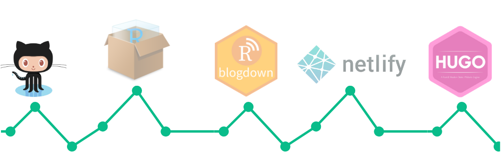

<p style="text-align:justify">Tháng mới, blog vẫn là các bài viết cũ nhưng hiện nay đã có một giao diện mới, khá là đẹp. Tuy nhiên còn vài điểm mình chưa hài lòng cho lắm. Nhưng do vốn kiến thức có hạn nên mình cũng không biết phải thay đổi như thế nào, cuối cùng chỉ có thể chấp nhận kết quả như vậy. Có lẽ, hạnh phúc là biết hài lòng với những gì mình đang có.</p>

<p style="text-align:justify">Không lòng vòng nữa, chúng ta quay trở lại với nội dung chính của bài viết này: <i><b>Mình đã tạo blog này như thế nào?</i></b></p>

### Tại sao mình lại viết blog

<p style="text-align:justify">Có khá là nhiều lý do để mình lựa chọn viết blog. <b>Đầu tiên</b> là vì sở thích viết lách, nhất là vào những lúc tâm trạng không tốt. Càng trưởng thành, chúng ta lại có càng nhiều vấn đề.</p>

<p style="text-align:justify">Có người lựa chọn phớt lờ chúng, tự cuốn mình vào những công việc và mối quan hệ khác để làm bản thân thật bận rộn. Khi bạn bận rộn bạn sẽ không còn nhớ đến chúng nữa. Cũng có người như mình, lựa chọn viết chúng ra, cái cảm giác ngồi một góc sắp xếp lại những suy nghĩ lộn xộn trong đầu rồi bắt đầu gõ phím cạch cạch làm mình bình tĩnh hơn để đối diện và tìm giải pháp với những vấn đề đó.</p>

<p style="text-align:justify"><b>Lý do tiếp theo</b>, viết blog là một phương pháp học tập rất hiệu quả - <i>"Learning by writing"</i>. Có một sự thật là, nếu chỉ đọc mà không suy nghĩ thì sẽ không hiểu được. Suy nghĩ mà không ứng dụng, không bắt tay vào làm thì sẽ chẳng thể nhớ được. Và viết sẽ giúp chúng ta sắp xếp lại các suy nghĩ logic mạch lạc hơn, dễ hiểu và dễ nhớ hơn.</p>

<p style="text-align:justify"><b>Cuối cùng</b>, viết blog giúp mình lưu trữ và chia sẻ thông tin. Chúng ta không thể nào nhớ được hết tất cả mọi thứ, trừ khi bạn là một người có trí nhớ siêu tốt. Do đó mình cần những bài viết giúp mình lưu trữ thông tin để có thể tra cứu lại khi cần thiết.</p>

### Chuẩn bị trước khi tạo blog



<p style="text-align:justify">Blog này của mình được xây dựng bằng <i><a href="https://bookdown.org/yihui/blogdown/">blogdown</a></i> dựa trên nền tảng của <i><a href="https://gohugo.io/">Hugo</a></i>, sau đó lưu trữ trên <i><a href="https://github.com/">Github</a></i> và build bằng <i><a href="https://www.netlify.com/">Netlify</a></i>. Do đó, trước khi bắt tay vào tạo blog, mình cần chuẩn bị một số nội dung sau:</p>

- Cài đặt _[Hugo](https://gohugo.io/getting-started/installing/)_
- Cài đặt _[R](https://www.r-project.org/)_, _[RStudio](https://www.rstudio.com/)_ và _[blogdown](https://github.com/rstudio/blogdown#installation)_
- Cài đặt _[Git for Windows](https://git-scm.com/download/win)_ và tạo tài khoản _[Github](https://github.com/signup)_
- Chọn theme cho blog, có khá là nhiều theme _[ ở đây](https://themes.gohugo.io/)_ để cho bạn lựa chọn, còn blog này của mình thì sử dụng theme _[Apéro](https://github.com/hugo-apero/hugo-apero)_


### Các bước tạo một blog đơn giản

<p style="text-align:justify">Sau khi đã chuẩn bị xong những nội dung ở trên, bước tiếp theo là đi tạo blog. Và do mình sử dụng theme <code>Apéro</code> nên mình sẽ thực hiện các bước theo hướng dẫn của <i><a href="https://www.apreshill.com/">Alison Hill</a></i>, tác giả của theme này. Còn nếu bạn sử dụng một theme khác thì về cơ bản quy trình cũng tương tự như vậy.</p>



### Những việc mình làm sau khi tạo blog

<p style="text-align:justify">Để tạo một blog thì khá đơn giản, bạn chỉ cần thực hiện vài thao tác giống như video của <i>Alison Hill</i> là bạn đã có một blog để bắt đầu viết bài rồi. Nhưng vì mình muốn tùy chỉnh theo ý của riêng mình nên tiếp theo đây sẽ là những công việc làm mình cảm thấy tốn nhiều thời gian nhất.</p>

<p style="text-align:justify">Việc đầu tiên mình làm sau khi tạo blog là đọc các bài hướng dẫn từ <i><a href="https://hugo-apero-docs.netlify.app/learn/">Hugo Apero Docs</a></i> và tiến hành tùy chỉnh hai trang <i><a href="/">Home page</a></i> và <i><a href="/about/">About page</a></i>.</p>

<p style="text-align:justify">Bước tiếp theo là tạo các <b><i>Menu</i></b> và thiết kế định dạng cho từng menu của blog, gồm có: <i><b>Blog, Notes, Projects và My Diary</b></i>. Các định dạng này được tùy chỉnh ở phần <i><a href="https://github.com/ktuyends/ktuyenx/tree/main/layouts">Layout</a></i> của project.</p>

<p style="text-align:justify">Ngoài các bài viết cơ bản bằng <code>Markdown</code>, mình sẽ thường viết các bài mang tính kỹ thuật sử dụng <code>Python, SQL</code> và <code>DAX</code> nên <b>Syntax Highlighting</b> là một tính năng không thể thiếu, nó giúp cho code rõ ràng và dễ đọc hơn. Tuy nhiên, Hugo Apéro lại sử dụng <i><a href="https://gohugo.io/content-management/syntax-highlighting/">Chroma</a></i> mà Chroma thì không hỗ trợ <code>DAX</code>. Nên mình đã phải sử dụng một thư viện thay thế - <i><a href="https://prismjs.com/">PrismJS</a></i>, theo hướng dẫn của <i><a href="https://www.willhallonline.co.uk/blog/2019-04-12-adding-prismjs-code-highlighting-to-hugo/">Will Hall Online</a></i>.</p>

Một trong những tính năng không thể thiếu của blog đó là hệ thống bình luận. Vì vốn kiến thức có hạn, nên blog này của mình chỉ sử dụng <i><a href="https://utteranc.es/">Utterances</a></i>, được tùy chỉnh trong file <code>config.toml</code>

```toml
# Configuration of https://utteranc.es/ for comments
[params.utterances]
  use_utterances = true
  repo_name = ""
  issue_term = "title" # url, pathname, or title
  theme = "boxy-light"
  label = "comments :crystal_ball:"
```

<p style="text-align:justify"><b>Cuối cùng</b>, sau khi đã hoàn thành hết tất cả những công việc trên, mình tiến hành thay đổi <i><a href="https://hugo-apero-docs.netlify.app/learn/fonts/">font chữ</a></i> và <i><a href="https://hugo-apero-docs.netlify.app/learn/color-themes/">màu sắc</a></i> để có một giao diện đẹp mắt và dễ nhìn hơn.</p>
