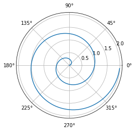

## 1. Một số cú pháp markdown cơ bản

### 1.1. Math

Inline: $a^2 + b^2 = c^2$

Newline:

$$ f(x)=\int_{-\infty}^{\infty} \hat{f}(\xi) e^{2 \pi i \xi x} d \xi $$

### 1.2. Heading

```markdown
## h2 Heading {#custom-id}
### h3 Heading
#### h4 Heading
##### h5 Heading
###### h6 Heading
```

### 1.3. Comments

<!--
This is a comment
-->

### 1.4. Format:


*rendered as italicized text*
**rendered as bold text**
***bold and italics***
~~Strike through this text.~~


### 1.5. Blockquotes

> Đây là một đoạn code
>> Đây là một đoạn code trong một đoạn code

### 1.6. List

Dạng 1:


1. Lorem ipsum dolor sit amet
2. Consectetur adipiscing elit
3. Integer molestie lorem at massa


Dạng 2:


- Facilisis in pretium nisl aliquet
- Nulla volutpat aliquam velit
    - Phasellus iaculis neque
    - Purus sodales ultricies

Dạng 3, Task list:


- [x] Write the press release
- [ ] Update the website
- [ ] Contact the media


### 1.7. Code

**Inline:**

```markdown
In this example, `<section></section>` should be wrapped as **code**.
```

<details>
<summary>
Hide Code
</summary>

```python
import matplotlib.pyplot as plt
import numpy as np

t = np.arange(0.0, 2.0, 0.01)
s = 1 + np.sin(2*np.pi*t)
plt.plot(t, s)

plt.xlabel('time (s)')
plt.ylabel('voltage (mV)')
plt.title('About as simple as it gets, folks')
plt.grid(True)
plt.savefig("test.png")
plt.show()
```

</details>

**Gist:**



### 1.11. Table

| Option | Description |
| ------ | ----------- |
| data   | path to data files to supply the data that will be passed into templates. |
| engine | engine to be used for processing templates. Handlebars is the default. |
| ext    | extension to be used for dest files. |

### 1.8. Link


<https://assemble.io>

<contact@revolunet.com>

[Assemble](https://assemble.io)

[Upstage](https://github.com/upstage/ "Visit Upstage!")


### 1.9. Footnotes


This is a digital footnote[^1].
This is a footnote with "label"[^label]

[^1]: This is a digital footnote
[^label]: This is a footnote with "label"


### 1.10. Image & Figure


### 1.11. Other Shorcodes

**Chèn Vimeo**



**Chèn Youtube**



## 2. Python Code


```python
import numpy as np
import matplotlib.pyplot as plt

r = np.arange(0, 2, 0.01)
theta = 2 * np.pi * r
fig, ax = plt.subplots(subplot_kw={'projection': 'polar'})
ax.plot(theta, r)
ax.set_rticks([0.5, 1, 1.5, 2])
ax.grid(True)
plt.show()
```


    

    


## 3. Convert notebook to Markdown

```bash
jupyter nbconvert index.ipynb --to markdown --NbConvertApp.output_files_dir=.
```
