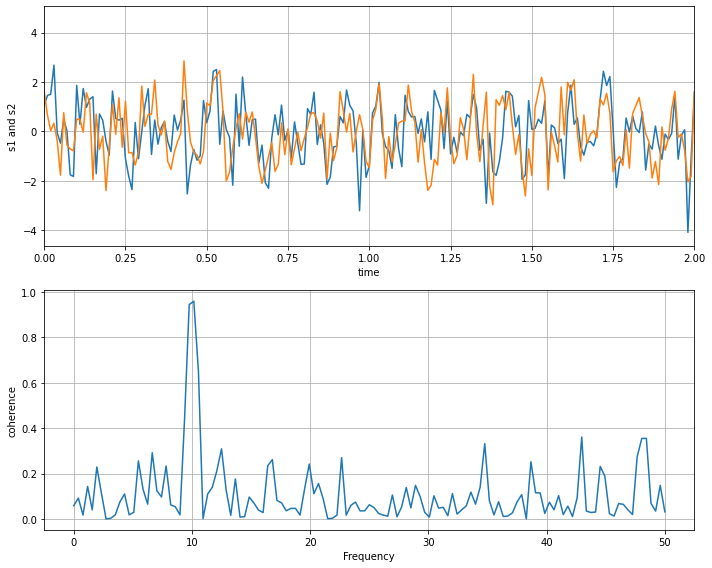

## 1. Basic Markdown

### 1.1. Math

Example from the [mathjax demo](https://www.mathjax.org/#demo):

When `\(a \ne 0\)`, there are two solutions to \\(ax^2 + bx + c = 0\\) and they are

$$x = {-b \pm \sqrt{b^2-4ac} \over 2a}.$$

If I have a random \$ and another \$ in my text.

$$sd = \sqrt{\frac{\sum_{i=0}^{n}{(x_i-\bar x)^2}}{(n-1)} }$$

### 1.2. Heading

```markdown
## h2 Heading {#custom-id}
### h3 Heading
#### h4 Heading
##### h5 Heading
###### h6 Heading
```

### 1.3. Comments

```markdown
<!--
This is a comment
-->
```

### 1.4. Format:

```markdown
*rendered as italicized text*
**rendered as bold text**
***bold and italics***
~~Strike through this text.~~
```

### 1.5. Blockquotes

```markdown
> Đây là một đoạn code
>> Đây là một đoạn code trong một đoạn code
```

### 1.6. List

Dạng 1:

```markdown
1. Lorem ipsum dolor sit amet
2. Consectetur adipiscing elit
3. Integer molestie lorem at massa
```

Dạng 2:

```markdown
- Facilisis in pretium nisl aliquet
- Nulla volutpat aliquam velit
    - Phasellus iaculis neque
    - Purus sodales ultricies
```

Dạng 3, task list:

```markdown
- [x] Write the press release
- [ ] Update the website
- [ ] Contact the media
```

### 1.7. Code

**Inline:**

```markdown
In this example, `<section></section>` should be wrapped as **code**.
```

<details>
<summary>
Hide Code
</summary>

```python
import matplotlib.pyplot as plt
import numpy as np

t = np.arange(0.0, 2.0, 0.01)
s = 1 + np.sin(2*np.pi*t)
plt.plot(t, s)

plt.xlabel('time (s)')
plt.ylabel('voltage (mV)')
plt.title('About as simple as it gets, folks')
plt.grid(True)
plt.savefig("test.png")
plt.show()
```

</details>

**Gist:**



### 1.8. Table

| Option | Description |
| ------ | ----------- |
| data   | path to data files to supply the data that will be passed into templates. |
| engine | engine to be used for processing templates. Handlebars is the default. |
| ext    | extension to be used for dest files. |

### 1.9. Link


```markdown
<https://assemble.io>

<contact@revolunet.com>

[Assemble](https://assemble.io)

[Upstage](https://github.com/upstage/ "Visit Upstage!")
```

### 1.10. Footnotes

```markdown
This is a digital footnote[^1].
This is a footnote with "label"[^label]

[^1]: This is a digital footnote
[^label]: This is a footnote with "label"
```

### 1.11. Image & Figure

```markdown


```

```html

```

### 1.12. Shortcodes

**Chèn Vimeo**



**Chèn Youtube**




## 2. Python Code


```python
import numpy as np
import matplotlib.pyplot as plt

# Tùy chỉnh size của đồ thị được tạo ra
plt.rcParams["figure.figsize"] = (10, 8)

# Fixing random state for reproducibility
np.random.seed(19680801)

dt = 0.01
t = np.arange(0, 30, dt)
nse1 = np.random.randn(len(t))                 # white noise 1
nse2 = np.random.randn(len(t))                 # white noise 2

# Two signals with a coherent part at 10Hz and a random part
s1 = np.sin(2 * np.pi * 10 * t) + nse1
s2 = np.sin(2 * np.pi * 10 * t) + nse2

fig, axs = plt.subplots(2, 1)
axs[0].plot(t, s1, t, s2)
axs[0].set_xlim(0, 2)
axs[0].set_xlabel('time')
axs[0].set_ylabel('s1 and s2')
axs[0].grid(True)

cxy, f = axs[1].cohere(s1, s2, 256, 1. / dt)
axs[1].set_ylabel('coherence')

fig.tight_layout()
plt.show()
```


    

    


## 3. Convert Notebook to Markdown

Cú pháp:

```bash
jupyter nbconvert index.ipynb --to markdown --NbConvertApp.output_files_dir=.
```
